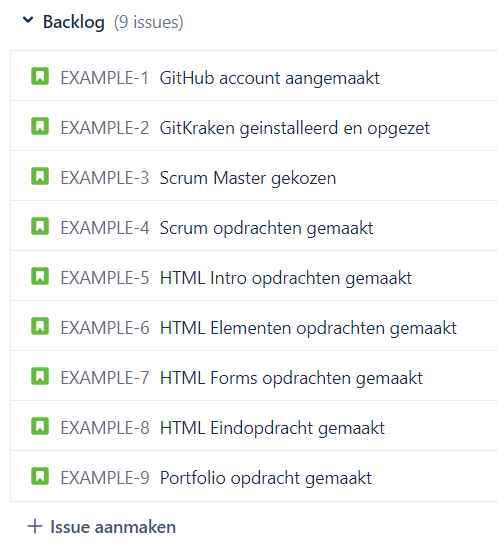

# Scrum 

Scrum is een projectmanagement methode die vooral bij software-ontwikkeling erg veel gebruikt wordt. Zodoende gaan we er ook tijdens de opleiding veel gebruik van maken.

Elk scrum project bestaat uit 1 of meer teams en heeft minstens 3 verschillende rollen:

* **_Product Owner_** 
    * De _Product Owner_ is degene die verantwoordelijkheid draagt naar de klant toe en nauw betrokken is bij het maken van belangrijke keuzes en het stellen van prioriteiten.
* **_Development Team_**
    * Dit zijn alle ontwikkelaars die samen verantwoordelijk zijn voor het eindproduct. 
* **_Scrum Master_**
    * Elk team heeft 1 _Scrum Master_, die de voortgang van het team controleert.

Er wordt ook wel eens gebruik gemaakt van extra rollen voor gebruikers of andere belanghebbenden, maar die zijn lang niet altijd bij het proces betrokken.

In een scrum project wordt het project onderverdeeld in **_Sprints_** - dat zijn periodes van 1 tot 4 weken. Elke sprint heeft een vast ritme, met 4 meetings die gehouden moeten worden:

* **_Sprint Planning_**
    * Wordt aan het begin van elke sprint gehouden. Tijdens de Sprint Planning bepaalt het team samen met de Product Owner wat de sprint doelen zijn, en wordt er bepaald wie welke taak op zich neemt.
* **_Daily Stand Up_**
    * Aan het begin van elke dag komt het team kort samen. Hier komt het team samen om te bespreken wat ze op die dag gaan doen.
* **_Sprint Review_**
    * Aan het einde van elke Sprint is er een Sprint Review. Hierin laat het team hun voortgang zien aan de opdrachtgever door middel van een presentatie.
* **_Sprint Retrospective_**
    * Na de Sprint Review is er nog 1 laatste meeting; de Sprint Retrospective. Dit is een moment voor zelfreflectie met het hele team. Hier beoordeelt iedereen zijn/haar prestaties en worden afspraken gemaakt om het proces te verbeteren.

Dit is heel kort hoe een Scrum project eruit ziet. Maar hoe bepaalt zo’n Scrum team nou wat er precies gedaan moet worden, en hoe houdt het team dat allemaal bij?

# User Stories

User Stories zijn een manier om je doelen te beschrijven die ook bij Scrum veel wordt gebruikt. De naam is veelzeggend - het zijn namelijk korte verhalen, geschreven vanuit het perspectief van de gebruikers. Deze worden gemaakt aan de hand van de eisen van de opdrachtgever.

Voorbeelden van User Stories:

* Als gebruiker wil ik kunnen inloggen
* Als gebruiker wil ik mijn wachtwoord kunnen veranderen
* Bij het openen van de website verschijnt er een pop-up om in te loggen

Er zijn ook grotere user stories, die de hele interactie van een gebruiker met je product beschrijft - die worden ook wel _Epics_ genoemd. Deze worden vaak opgebroken in kleinere User Stories. Bijvoorbeeld:

* Als gebruiker wil ik de producten op de webshop browsen, individuele producten bekijken, meerdere producten toevoegen aan een winkelwagen en afrekenen.

Nadat al deze User Stories gemaakt zijn worden ze nog voor de eerste Sprint begint twee keer gesorteerd:

* Sommige User Stories zijn belangrijker dan anderen - daarom worden ze gesorteerd op _prioriteit_. Dit doet de Product Owner samen met de opdrachtgever.
* Sommige User Stories zijn makkelijker te implementeren dan anderen - daarom worden ze gesorteerd op _werkdruk_. Dit doet het Development Team.

Soms wordt er bij dit soort meetings gebruik gemaakt van **_Planning Poker_**, Daarbij krijgt iedereen een verzameling kaarten met scores. Vervolgens kan iedereen apart elke User Story een score toewijzen zonder dat ze elkaars mening beïnvloeden. 

Hiermee wordt bij elke Sprint Planning besloten wat er moet, en hoeveel er kan. Om dat te faciliteren moeten al deze User Stories dus wel bijgehouden worden. Hiervoor zijn verschillende tools te gebruiken - tijdens de opleiding gaan we gebruik maken van **_Jira_**.

# Jira

Jira is een project-management tool van Atlassian. Op Jira kan je gemakkelijk bijhouden wat er nog te doen is en wie waarvoor verantwoordelijk is. Daarnaast heeft Jira ook veel ondersteuning voor de Scrum methode - daarom gaan we het gebruiken om jullie taken en voortgang bij te houden.

Het beheren van een Jira board is in principe de taak van de Scrum Master, maar binnen de opleiding zal het iets anders werken. Wij vinden het namelijk belangrijk dat iedereen ervaring opbouwt met Jira. Het is zeker niet de makkelijkste tool om mee om te gaan, maar het wordt in IT bij heel veel bedrijven gebruikt.

Daarom willen we dat **iedereen** een eigen Jira account + board aanmaakt. Voeg de Learning Coaches aan je board toe als het gelukt is.

Daarnaast willen we dat jullie per groepje een Scrum Master aanwijzen. Deze persoon is verantwoordelijk voor de stand-up. Hierbij kan iedereen even kort zijn Jira board laten zien - daarmee wordt dan voor de hele groep duidelijk waar die persoon mee bezig is.

Elke issue kan je ook aan een of meer mensen toewijzen. Voor de eerste maanden van de opleiding zullen de opdrachten voor iedereen hetzelfde zijn. 

Een voorbeeld van hoe een backlog eruit kan zien:

Als je backlog is aangemaakt kan je een Sprint starten en issues uit de backlog aan die Sprint toewijzen.

Er zijn bij Scrum bepaalde criteria die bepalen of iets echt klaar is of niet. Als voorbeeld kan het zo zijn dat je niet alleen de code voor een opdracht moet schrijven, maar dat je die ook zelf getest hebt. Dit soort eisen variëren per bedrijf.

Wanneer je iets in de kolom “Done” kan zetten is dus afhankelijk van randvoorwaarden. Bij deze criteria wordt er onderscheid gemaakt tussen 2 soorten: voorwaarden die voor ELKE issue gelden en voorwaarden die alleen voor 1 specifieke User Story gelden. Deze worden ook wel de **_Definition of Done _**en **_Acceptatiecriteria_** genoemd.

# Definition of Done

De Definition of Done is een verzameling criteria die voor elke User Story moeten gelden, voordat deze als done afgevinkt kunnen worden. Deze criteria hoeven niet altijd hetzelfde te zijn, en worden in samenspraak door het team opgesteld. 

Voorbeelden van DoD criteria:

* Peer Reviewed
* Product Owner heeft goedkeuring gegeven
* Software is automatisch getest

# Acceptatiecriteria

De acceptatiecriteria is een verzameling vereisten voor een bepaalde User Story. Elke User Story heeft zijn eigen acceptatiecriteria die tijdens het plannen worden opgesteld. Een voorbeeld van een User Story met acceptatiecriteria:

* Als gebruiker wil ik kunnen inloggen
    * Alleen bij het invullen van correcte gegevens
    * Bij invullen van incorrecte gegevens wordt een foutmelding weergegeven
    * Als gegevens niet worden ingevuld, wordt er een andere foutmelding getoond
    * Bij het inloggen vanaf een onbekend IP-adres wordt er een mail verstuurd
    * Je kan maar een bepaald aantal keer per kwartier proberen in te loggen

# Opdrachten

Zorg dat je een Jira account hebt aangemaakt. Doe daarnaast onderzoek zodat je de volgende 2 vragen kan beantwoorden:

1. Welke vragen moet iedereen tijdens de Daily Stand Up aan zichzelf stellen?
2. Wat zit er in de Scrum Retrospective?

Je kan ook overwegen om een Scrum certificaat te halen via Certiprof: 

[https://certiprof.com/pages/scrum-foundation-certificate-free](https://certiprof.com/pages/scrum-foundation-certificate-free)

Dit certificaat is niet super waardevol op de arbeidsmarkt, maar het is wel een hele goede manier om te toetsen of je de Scrum methodiek echt helemaal snapt.