# **CSS Deep Dive**

 

# **Introductie**

Tijdens de selectieperiode heb je al kennisgemaakt met de uitdagingen en complexiteit van CSS. In deze Deep Dive kijken we met veel detail naar de belangrijkste onderwerpen in CSS. 

Deze handout bevat veel meer opdrachten dan de handouts die je hiervoor hebt gezien. Ze staan ook onderaan per hoofdstuk ipv allemaal aan het einde. Daarom is het extra belangrijk om een goede structuur in je git repository aan te houden! Gebruik voor elke praktijkopdracht een aparte .html file, en sorteer de opdrachten goed per hoofdstuk

 

# **Inhoud**

**1.        Selectors & Visual rules**

  * Leren over het opmaken van individuele elementen en groepselementen met behulp van verschillende visuele CSS-regels.

**2.        Het box model**

  * Leren hoe het box-model gebruikt wordt om HTML-elementen op webpagina’s te plaatsen.

**3.        Positioning**

  * Leren over de CSS-regels voor het weergeven en positioneren van elementen op webpagina’s.

**4.        Pseudo elements**

  * Leren over de werking en het gebruiken van pseudo elementen als krachtige tools om je webpagina extra stijl te geven.

**5.        Flexbox**

  * Leren over het gebruik van flexbox en de voordelen die het heeft ten opzichte van het gewone box model.

**6.        CSS Grid**

  * Leren over het gebruik van CSS Grid en wanneer / hoe je dit optimaal kan inzetten.

**7.        Transitions**

  * Leren over hoe je met transitions en animations het gedrag en uiterlijk van elementen kunt beïnvloeden zonder gebruik te hoeven maken van Javascript.

**8.        Media queries**

  * Leren over hoe je een pagina responsive kan maken, zodat het op meerdere scherm goed uitziet.

**9.        Extra oefenopdracht**

  * Deze bonus opdracht is het maken van een volledige webpage. Dit optioneel maar biedt wel goede oefening en voorbereiding op de portfolio opdracht.

 

# **Selectors & Visual rules**

In CSS worden selectors gebruikt om de HTML elementen op een webpagina te targeten die we willen stylen. Er is een grote verscheidenheid aan CSS-selectors beschikbaar, die een grote precisie mogelijk maken bij het selecteren van elementen om te stijlen.

Een CSS-selector is het eerste deel van een CSS-regel. Het is een patroon van elementen en andere termen die de browser vertellen welke HTML-elementen moeten worden geselecteerd om de CSS-eigenschappen binnen de regel toe te passen. Het element of de elementen die door de selector worden geselecteerd, worden ‘the subject of the selector’ genoemd. Hieronder zie je het h1 en p element die als selectors worden gebruikt.

Lees meer over selectors in de officiele documentatie van [MDN](https://developer.mozilla.org/en-US/docs/Web/CSS/CSS_Selectors) of [w3schools](https://www.w3schools.com/cssref/css_selectors.asp).

 

## **Opdrachten**

 

### **Opdracht 1**

Je kunt op 3 verschillende manieren CSS in je HTML inladen. Op welke 3 manieren kun je dat doen? Leg ook voor elke wijze uit wat het precies inhoud.

 

### **Opdracht 2**

CSS pas je toe met een bepaalde syntax. Hoe ziet zo'n syntax eruit? Kun je ook uitleggen wat elk element uit de syntax betekent?

 

### **Opdracht 3**

Er zijn verschillende selectors, bijvoorbeeld;

* type selectors
* class selectors
* ID selectors
* descendant selectors

Maak van de bovengenoemde selectors voorbeelden. Geef in je antwoord ook aan wat de voordelen zijn van elke selector.

 

### **Opdracht 4**

Maak een .html file en voeg de volgende code toe:

Maak het onderstaande na door gebruik te maken van selectors. De kleuren die hiervoor gebruikt zijn is green en darkblue.

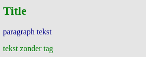

 

### **Opdracht 5**

Maak een aparte html bestand en voeg de volgende code toe:

Maak het onderstaande na door gebruik te maken van selectors. De kleuren die hiervoor gebruikt zijn is green en black.

 

### **Opdracht 6**

Verder heb je ook nog de volgende selectors:

* universal selector
* attribute selectors
* child selectors
* adjacent sibling selectors
* general sibling selectors

Maak een .html file waar je alledrie in gebruikt

 

### **Opdracht 7**

Je kan selectors ook op meerdere manieren combineren. Bijvoorbeeld:

* Een selector die alle elementen met type div EN class “opdracht” selecteert
* Meerdere selectors die hetzelfde stukje CSS gebruiken

Maak een .html file waarin beide voorbeelden worden gebruikt

 

### **Opdracht 8**

Styling die je toepast wordt toegepast in een bepaalde volgorde. Het kan voorkomen dat je styling toepast en vervolgens niet het gewenste resultaat ziet. **_Cascade_** en **_Inheritance_** zijn belangrijke concepten om te begrijpen hoe styling werkt. Lees hier in de officiële documentatie meer over [cascade en inheritance](https://developer.mozilla.org/en-US/docs/Learn/CSS/Building_blocks/Cascade_and_inheritance).

Zoek ook andere referenties om het concept te begrijpen.

Leg in eigen woorden uit wat met cascade en inheritance wordt bedoeld. Maak voorbeelden om je antwoord uit te leggen.

 

### **Meer weten?**

Je kunt meer informatie vinden over deze concepten in [deze video](https://www.youtube.com/watch?v=Sp9ZfSvpf7A&feature=youtu.be)

 

# **Het box-model**

Alles in CSS heeft een zogenaamde ‘box’ eromheen en het begrijpen van deze ‘boxen’ is de sleutel om lay-outs met CSS te kunnen maken of om items met andere items uit te lijnen. In deze les zullen we het CSS-box-model goed bekijken zodat je complexere layouts kunt bouwen met een beter inzicht in hoe het werkt en de terminologie die daarmee verband houdt. In CSS wordt de term "box model" gebruikt wanneer we het dus hebben over ontwerp en lay-out. Elke ‘box’ in CSS bestaat uit: ‘margins’, ‘borders’, ‘padding’, en de ‘content’ oftewel de inhoud. De onderstaande afbeelding illustreert het box-model. Officiële documentatie over het box-model vind je [hier op deze website](https://developer.mozilla.org/en-US/docs/Learn/CSS/Building_blocks/The_box_model).

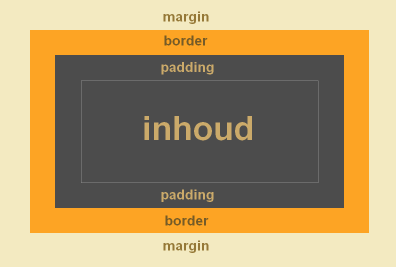

 

## **Opdrachten**

 

### **Opdracht 1**

Wat zijn de eigenschappen van block boxes en inline boxes?

 

### **Opdracht 2**

Maak wat hieronder staat met paragraph en span tags.

 

### **Opdracht 3**

Wat gebeurt er als je een width en een height toevoegt aan de span tag ( &lt;span> ) van vorige opdracht?

 

### **Opdracht 4**

Hieronder zie je een box-model:

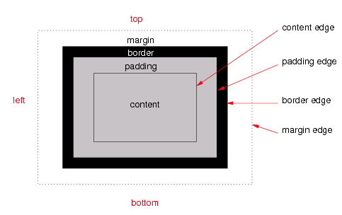

Leg uit wat de volgende termen betekenen: content, padding, margin en border.

 

### **Opdracht 5**

Als je ruimte wilt maken tussen de border en content, welke css property gebruik je dan? Maak een voorbeeld in je antwoord. 

 

### **Opdracht 6**

Als je ruimte wilt maken tussen de border en buiten de box, welke css property gebruik je dan? Maak een voorbeeld in je antwoord.

 

### **Opdracht 7**

Maak nu een blok met width: 100px, height: 100px, margin: 5px, padding 5px en border-width: 5px. Zie hieronder:

1. Hoe breed is de box?

2. Hoe hoog is de box?

3. Wat merk je op met width en height?

 

### **Opdracht 8**

Welke CSS property kun je gebruiken om ervoor te zorgen dat de waarde van width en height de totale breedte en hoogte is van het blok van de voorgaande opdracht?

 

# **Display & Positioning**

De CSS ‘position’ property bepaalt hoe een HTML element in een document wordt gepositioneerd. Je kunt elk HTML-element op elke gewenste locatie plaatsen. Je kunt bijvoorbeeld aangeven of je het element relatief ten opzichte van de standaardpositie op de pagina wilt plaatsen of absoluut op basis van het bovenliggende element. De top, right, bottom en left properties bepalen de uiteindelijke locatie van geplaatste elementen. Officiële documentatie over display & positioning vind je [hier op deze website](https://developer.mozilla.org/en-US/docs/Web/CSS/position).

 

## **Opdrachten**

 

### **Opdracht 1**

De belangrijkste waardes van “position” zijn static, relative, absolute, fixed & sticky. Leg voor elke uit wat ze doen.

 

### **Opdracht 2**

Zie de onderstaande HTML code.

&lt;h1>Dit is een titel&lt;/h1>

&lt;p>Dit is een paragraaf.&lt;/p>

&lt;p>Dit is nog een paragraaf.&lt;/p>

Zorg ervoor dat het &lt;h1> element altijd 50px van de top en 50px van de rechterkant van het scherm zichtbaar is. Maak het &lt;h1> element rood door een RGB kleurcodering toe te passen.

 

### **Opdracht 3**

Zorg er nu voor dat het &lt;h1> element uit de voorgaande opdracht 20px links en 30px naar onder wordt geplaatst, relatief t.o.v. diens normale positie.

 

### **Opdracht 4**

Zorg er nu voor dat het &lt;h1> element uit opdracht 2 50px links en 100px van de top wordt geplaatst relatief t.o.v. de HTML pagina.

 

### **Opdracht 5**

Positioneer het &lt;img> element achter de tekst. Zie voorbeeld hierboven en gebruik onderstaande HTML code. Je mag een eigen image gebruiken.

&lt;h1>Dit is een titel&lt;/h1>

&lt;p>Dit is een paragraaf.&lt;/p>

&lt;p>Dit is nog een paragraaf.&lt;/p>

&lt;img src="./bg-image-colors.jpg"/>

 

### **Opdracht 6**

Maak het onderstaande na door gebruik te maken van relative position. De outer div block is 100px breed en 100px hoog. De inner div block is 50px breed en 50px hoog.

 

### **Opdracht 7**

Zie de onderstaande image met tekst. Kun jij dit namaken? Gebruik zelf een foto van een zonnige bestemming. Gebruik position, maar je mag geen z-index toepassen.

 

### **Opdracht 8**

Maak het onderstaande na. Je mag zelf een image zoeken en gebruiken.

 

# **Pseudo elements**

In CSS worden stijlen normaal gedefinieerd ten behoeve van een element. Soms is het echter wenselijk effecten te bereiken, die niet mogelijk zijn als je alleen beschikt over element- of attribuut-selectors. Bijvoorbeeld het in een bepaalde opmaak weergeven van de eerste letter of de eerste regel van de inhoud van een element. Om dat soort effecten mogelijk te maken, zijn pseudo-elementen geïntroduceerd. Een pseudo-element kun je zien als een denkbeeldig element, dat weliswaar niet in het document voorkomt, maar waarvoor je wel een stijl kunt definiëren.

Het is supergaaf wat je kunt doen met pseudo-elementen. Ze ontgrendelen een heleboel interessante ontwerpmogelijkheden zonder de semantiek van de opmaak negatief te beïnvloeden. De meest gebruikte pseudo-elementen zijn ‘**:: before**’ en ‘**:: after**’. In het plaatje hieronder kun je zien hoe een pseudo-element werkt.

Omdat je pseudo elementen absoluut kunt positioneren, relatief t.o.v. de ‘parent’ element, kun je ze zien als twee extra lagen waar je mee kunt spelen voor elk element. Er zijn tal van mogelijkheden met pseudo-elementen, bijvoorbeeld meervoudige borders maken of meervoudige achtergronden. Op de website van [Nicolas Gallagher](http://nicolasgallagher.com/multiple-backgrounds-and-borders-with-css2/) kun je zien wat er nog meer mogelijk is met pseudo-elementen. Hieronder nog enkele voorbeelden van de mogelijkheden.

<table>
  <tr>
   <td><strong>Meervoudige borders</strong>
   </td>
   <td><strong>Meervoudige achtergronden</strong>
   </td>
  </tr>
  <tr>
   <td>
    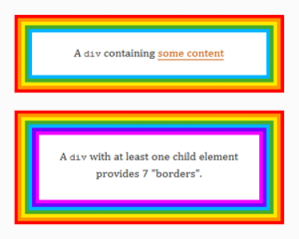
   </td>
   <td>
    
   </td>
  </tr>
</table>

**Allerlei vormen**

In de officiële documentatie kun je meer informatie terugvinden over pseudo elementen. Zie de volgende links: [Pseudo elements](https://developer.mozilla.org/en-US/docs/Web/CSS/Pseudo-elements) en [Pseudo classes](https://developer.mozilla.org/en-US/docs/Web/CSS/Pseudo-classes).

 

## **Opdrachten**

 

### **Opdracht 1**

Er zijn 14 verschillende pseudo-elementen. Beschrijf ze alle 14 kort en maak voor elk een voorbeeld

 

### **Opdracht 2**

Hieronder vind je een voorbeeld van het gebruik van een pseudo-element. Kun jij dit namaken?

 

### **Opdracht 3**

Hieronder vind je nog eens een voorbeeld van het gebruik van een pseudo-element ::before. Kun jij dit namaken? Gebruik een eigen afbeelding.

 

### **Opdracht 4**

Hieronder vind je wederom een voorbeeld van het gebruik van een pseudo-element. Kun jij dit namaken?

 

### **Opdracht 5**

De laatste opdracht vergt wat creativiteit. Zie het onderstaande voorbeeld en maak het na.

 

# **Flexbox**

Flexbox is een CSS model voor het positioneren van HTML-elementen. Het is een ideale techniek voor de ontwikkeling van een responsive layout. Het gebruik van ‘float’ en ‘absolute’ positioning is met deze techniek verleden tijd. Het grote voordeel van Flexbox is dat het een volwaardig CSS model is die je volledige controle geeft over de zaken die belangrijk zijn bij een responsive layout van je webpagina. Denk daarbij bijvoorbeeld aan de uitlijning en sortering van HTML-elementen. Daarnaast heb je geen onnodige divs of clears meer nodig.

De gedachte achter de flexibele lay-out is om de container de mogelijkheid te geven de breedte / hoogte (en volgorde) van de items te wijzigen, om de beschikbare ruimte zo goed mogelijk te vullen (meestal voor alle soorten displays en schermformaten). Een flexibele container breidt items uit om beschikbare vrije ruimte te vullen of verkleint ze om overflow te voorkomen.

Het belangrijkste is dat de lay-out van de flexbox niet richtingsafhankelijk is, in tegenstelling tot de reguliere lay-outs (block dat verticaal is gebaseerd en inline block dat horizontaal is gebaseerd). Hoewel die goed werken voor pagina's, missen ze flexibiliteit om grote of complexe toepassingen te ondersteunen (vooral als het gaat om het veranderen van oriëntatie, formaat, uitrekken, verkleinen, enz.). Om meer te lezen over flexbox kun je de volgende websites bezoeken van [CSS-tricks](https://css-tricks.com/snippets/css/a-guide-to-flexbox/) en [MDN](https://developer.mozilla.org/en-US/docs/Web/CSS/flex).

 

## **Opdrachten**

 

### **Opdracht 1**

Zie het onderstaande voorbeeld en maak het na met flex. Gebruik **geen** width, height of line-height.

 

### **Opdracht 2**

Zie het onderstaande voorbeeld, de items staan nu anders uitgelijnd. Maak het na met flex. Gebruik **geen** width, height of line-height.

 

### **Opdracht 3**

Zie het onderstaande voorbeeld, een van de items is breder dan de rest. Maak het na met flex. Gebruik **geen** width, height of line-height.

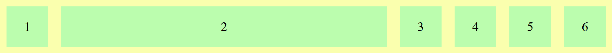

 

### **Opdracht 4**

De property ‘justify-content’ is een property die door flex gebruikt wordt. Maak een voorbeeld dat gebruik maakt van de align-items property.

 

### **Opdracht 5**

De property ‘align-items’ is een property die door flex gebruikt wordt. Maak een voorbeeld dat gebruik maakt van de align-items property.

 

### **Opdracht 6**

Maak het onderstaande na met flexbox. Properties die je o.a dient te gebruiken zijn:

* display
* justify-content
* flex-direction

 

### **Opdracht 7**

Maak het onderstaande na met flexbox. Properties die je o.a dient te gebruiken zijn:

* display
* justify-content
* flex-direction
* align-items

 

### **Opdracht 8**

Zie het onderstaande voorbeeld en maak het na met flexbox.

 

# **CSS Grid**

CSS Grid is een manier om de layout van je pagina in te delen, vergelijkbaar met Flexbox. Ook veel van de properties hebben vergelijkenis. CSS Grid is wel wat complexer / krachtiger - waar Flexbox items in 1 richting kan laten krimpen / groeien, kan CSS Grid dat in 2 richtingen doen. Zie onderstaand voorbeeld:

Je kan Grid dus zien als een soort “FlexBox 2.0”. Maar wanneer gebruik je dan wel Flexbox ipv Grid of vice versa? Een goede vuistregel om te onthouden is **Grid voor Layout, Flexbox voor Components**. Dat betekent dat je de eerste indeling van je pagina maakt met CSS Grid, en de aparte onderdelen van je pagina weer met Flexbox indeelt.

Grid is een complex onderwerp - de verwachting is niet dat je alles hiervan onthoudt. Des te belangrijker is het dat je een goede bron vindt die je kan (her)gebruiken om hierover te leren. De [CSS-tricks guide](https://css-tricks.com/snippets/css/complete-guide-grid/) en [MDN pagina](https://developer.mozilla.org/en-US/docs/Learn/CSS/CSS_layout/Grids) zijn beiden aan te raden.

Via de oefeningen gaan we Grid wat meer onderzoeken. Wil je nog meer ervaring met CSS Grid? Kijk dan naar [Grid Garden](https://cssgridgarden.com/) en/of [MDN Grid Playground](https://mozilladevelopers.github.io/playground/css-grid).

 

## **Opdrachten**

Voor deze opdrachten ga je template code gebruiken; deze kan je vinden onder opdrachten > grid.

 

### **Opdracht 1**

Bij CSS Grid wordt vaak gebruikgemaakt van een speciale lengte-eenheid: “**fr**”. Onderzoek wat deze doet en beschrijf het in je eigen woorden.

 

### **Opdracht 2**

Via “grid-template-rows” en “grid-template-columns” kan je de maten van je Grid bepalen. Via “grid-row” en “grid-column” kan je vervolgens het begin + einde van een item aangeven in respectievelijk horizontale en verticale richting.

Gebruik deze properties en maak het volgende na:

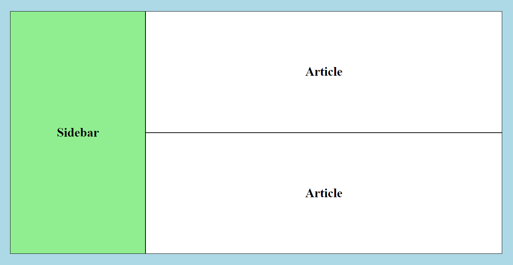

 

### **Opdracht 3**

Je kan bij grid ook een speciale waarde gebruiken voor herhalende rijen / kolommen: **repeat()**. Onderzoek hoe deze werkt en herschrijf nu de vorige opdracht met een repeat() waarde.

 

### **Opdracht 4**

Een andere vergelijkbare speciale waarde is de **minmax()** functie. Onderzoek hoe deze werkt en verwerk het in je grid.

 

### **Opdracht 5**

Soms is de grootte van je grid item niet precies hetzelfde als de maat die je Grid gebruikt. Dan kan je een aantal properties gebruiken om dit grid item binnen de aangewezen ruimte te positioneren. Dit kan je bepalen voor het hele grid tegelijkertijd, of per item individueel - net zoals bij flexbox!

Geef je “article” divs een “height: 200px;” en “width: 600px;”. Positioneer ze vervolgens zoals onderstaand:

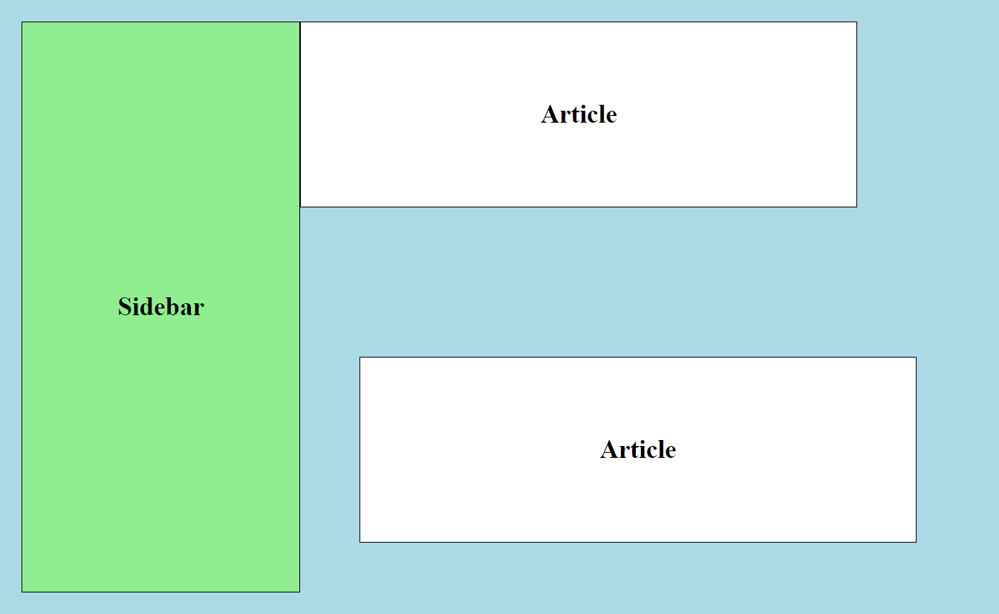

 

### **Opdracht 6**

Wat is het verschil tussen justify/align/place-items en justify/align/place-content?

 

### **Opdracht 7**

Je kan ook wat ruimte tussen je rijen / kolommen zetten met “grid-row-gap” / “grid-column-gap” of de shorthand “grid-gap”. Dit is vrij vergelijkbaar met padding / margin. Bij moderne browsers kan je “grid” uit de naam van deze CSS properties weglaten.

Geef je grid een gap van 10px.

 

### **Opdracht 8**

Tot zover heb je je grid ingedeeld met bepaalde maten en getallen gebruikt om het begin/einde van de rij/kolom aan te geven per item. Maar het kan ook anders!

Je kan namelijk ook bepaalde lijnen aangeven bij het indelen van je grid, en deze lijnen vervolgens als begin / eindpunt bepalen bij je items. Dit kan helpen met de overzichtelijkheid.

Geef je grid de waardes “grid-template-columns: [col-start] 300px [col-mid] 1fr [col-end];” en “grid-template-rows: [row-start] 1fr [row-mid] 1fr [row-end];”. Gebruik vervolgens **alleen** de namen van de lijnen om je grid-items in te delen.

 

### **Opdracht 9**

Je kan bij CSS Grid ook een “standaardmaat” voor rijen / kolommen definieren, mocht er een grid item “buiten” je gedefinieerde grid vallen. Als dat gebeurt wordt het een onderdeel van een **_implicit grid_**. Hoe groot dit implicit grid is qua maat kan je bepalen via **“grid-auto-columns”** en **“grid-auto-rows”**.

Vervang je “grid-template-rows” door “grid-auto-rows”. Maak een nieuwe “article” div met “grid-row-start: 5” om dit te testen.

Meer lezen over Implicit vs Explicit Grid? [Hier](https://css-tricks.com/difference-explicit-implicit-grids/) is een goed artikel.

 

### **Opdracht 10**

Tenslotte kan je ook bepaalde delen van je grid een naam geven. Dit doe je met de **“grid-template-areas”** property. Vervolgens kan je je grid items toewijzen aan een bepaald gebied met de **“grid-area”** property.

Gebruik grid-template-areas om je sidebar te benoemen. Gebruik vervolgens grid-area (en **geen** grid-column of grid-row!) om je sidebar de gepaste plek te geven.

 

# **Transitions**

CSS-transitions bieden een manier om de animatiesnelheid te regelen bij het wijzigen van CSS-properties. In plaats van het onmiddellijk wijzigen van de properties, kun je ervoor zorgen dat de wijzigingen in een property gedurende een bepaalde periode plaatsvinden. Als je bijvoorbeeld de kleur van een element verandert van wit naar zwart, dan is de verandering meestal onmiddellijk. Als CSS-transitions zijn toegepast, vinden er wijzigingen plaats met tijdsintervallen die een versnellingscurve volgen, die allemaal kunnen worden aangepast naar wens.

Animaties die een transitie tussen twee toestanden met zich meebrengen, worden vaak ‘implicit transitions’ genoemd, omdat de staat tussen de start- en eindstaat impliciet wordt gedefinieerd door de browser.

Met CSS-transitions kun je zelf beslissen welke properties jij wilt animeren (door ze expliciet te vermelden), wanneer de animatie zal starten (door een ‘delay’ in te stellen), hoe lang de transitie zal duren (door een ‘duration’ in te stellen) en hoe de transitie zal verlopen (door de ‘timing function’ te definiëren, bijv. ‘linear’ of ‘ease-in-out’).

Het is goed om te weten dat niet alle CSS-properties te animeren zijn. In de officiële documentatie is een lijst beschikbaar met een opsomming van de properties die je kunt animeren, oftewel, waar je transitions op kunt toepassen. Zie hier [de volledige lijst](https://developer.mozilla.org/en-US/docs/Web/CSS/CSS_animated_properties) van properties die je kunt animeren.

Wil je meer lezen over transitions? Bekijk de [officiële documentatie](https://developer.mozilla.org/en-US/docs/Web/CSS/CSS_Transitions/Using_CSS_transitions) en verdiep je verder in transitions en hoe het werkt.

 

## **Opdrachten**

 

### **Opdracht 1**

Zoek uit wat transitions zijn en beschrijf met eigen woorden wat het betekent.

 

### **Opdracht 2**

Maak een simpele transition die de kleur van een tekst aanpast.

 

### **Opdracht 3**

Transitions kent verschillende transition-timing. Zie hieronder een voorbeeld. Maak het na.

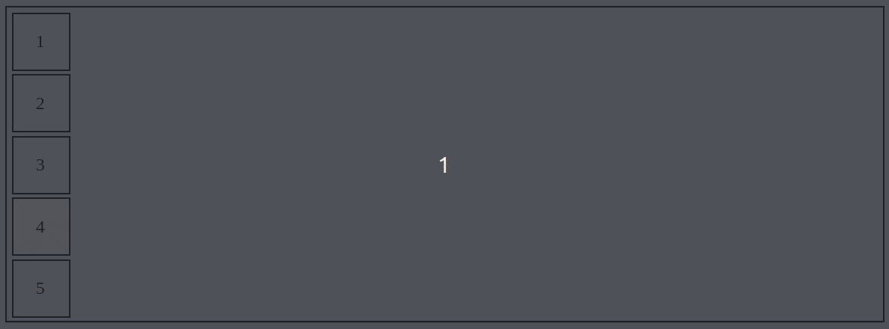

 

### **Opdracht 4**

Je kunt op verschillende properties transitions aangeven. Zie hieronder een voorbeeld. Zoek uit op welke properties de transitions zitten en maak het ongeveer hetzelfde na.

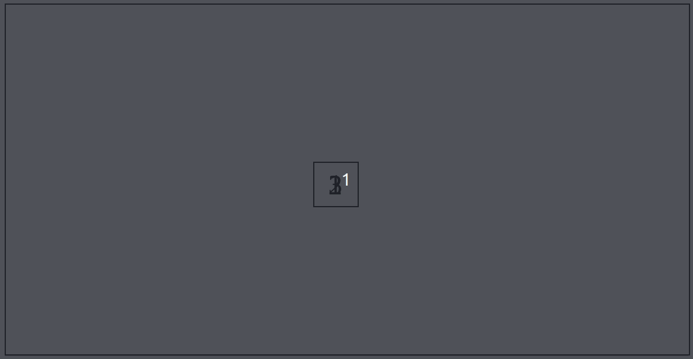

 

### **Opdracht 5**

Hieronder zie je wederom een voorbeeld van een transition. Je kunt op verschillende properties transitions aangeven. Zoek uit op welke properties de transitions zitten en maak het na. Je eigen creativiteit gebruiken is uiteraard toegestaan.

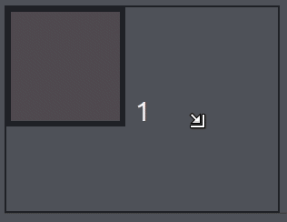

 

### **Opdracht 6**

Zie de onderstaande card deck. Kun jij deze zelf namaken? Je mag uiteraard weer je eigen creativiteit erop los laten.

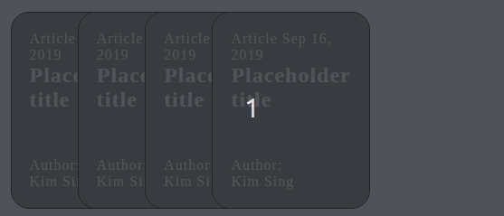

 

### **Opdracht 7 - extra opdracht (optioneel)**

Zie de onderstaande animatie en probeer deze na te maken. Hier is gebruik gemaakt van keyframe animatie.

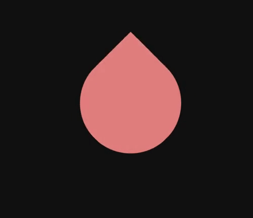

 

# **Responsive web design**

Het liefst wil je dat je website zich automatisch aanpast naar het apparaat dat je gebruikt, of eigenlijk naar de grootte van het browserscherm op dat apparaat.

Je maakt je site responsive met media queries. Een media query is een stukje code in de CSS stylesheet van je website, dat informatie zoals de grootte van het browserscherm van de bezoeker opvraagt tijdens het laden van jouw website. Weet je site wat de grootte van het browserscherm is, dan laat je site de opgevraagde informatie zien op de manier waarop je dat hebt opgezet. Dit stel je in met specifieke CSS stijlregels voor de verschillende schermgroottes.

Een website die zich met behulp van media queries aanpast aan de grootte van het browserscherm waarop het getoond wordt, heet een **responsive website**.

De kleinere browserschermen worden voornamelijk op mobiele apparaten gebruikt, maar je kunt het responsive effect ook zien wanneer je het browserscherm op je desktop verkleint. De media queries kijken namelijk alleen maar naar de grootte het browserscherm, en niet naar de grootte van het scherm zelf. Bekijk hier de [officiële documentatie](https://developer.mozilla.org/en-US/docs/Web/CSS/Media_Queries/Using_media_queries) om meer te leren over media queries.

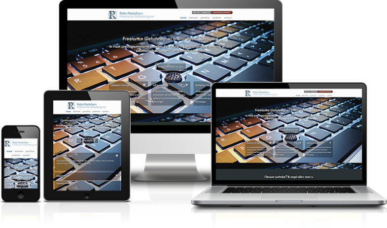

Media queries werken eigenlijk heel simpel. De media query die je gebruikt zoekt uit wat de grootte is van het browserscherm en past vervolgens de door jou gewenste CSS toe als desbetreffende schermgrootte wordt gevonden.

Hieronder zie je een media query staan die we stap voor stap gaan ontleden.

Wat hier eigenlijk staat is "Als het scherm wijder is dan 900 pixels dan moet de kleur van de tekst rood worden.

Het onderstaande plaatje laat nog eens goed zien hoe de media query is opgedeeld.

Hoe je media queries moet gebruiken om CSS-regels toe te passen op basis van schermgrootte en resolutie heb je hierboven kunnen zien, maar hoe bepaal je welke queries je moet instellen?

De punten waarop media queries worden ingesteld, worden ‘breakpoints’ genoemd. Breakpoints zijn de schermformaten waarop jouw webpagina niet correct meer wordt weergegeven. Als we bijvoorbeeld tablets willen targeten die in liggende stand staan, kunnen we de volgende breakpoint maken:

    @media only screen and (min-width: 768px) and (max-width: 1024px) and (orientation: landscape) {
      hier plaats je dan je gewenste CSS regels
    }

In het bovenstaande voorbeeld wordt een schermformaat gecreëerd ter grootte van een tablet in liggende modus en wordt ook de oriëntatie aangegeven.

Het instellen van breekpunten voor elk denkbaar apparaat zou echter ongelooflijk moeilijk zijn, omdat er veel apparaten zijn met verschillende vormen en maten. Daarnaast komen er elk jaar nieuwe toestellen uit met nieuwe schermformaten.

In plaats van breekpunten in te stellen op basis van specifieke apparaten, is het het beste om het formaat van de browser aan te passen om te zien waar de website van nature breekt op basis van de inhoud. De afmetingen waarop de lay-out ‘breekt’ oftewel, er vreemd uitziet, worden de breekpunten van jouw media query. Binnen die breekpunten kunnen we de CSS aanpassen om het formaat van de webpagina te wijzigen en te reorganiseren.

Door de afmetingen te observeren waarop een website van nature ‘breekt’, kun je mediaquery-breekpunten instellen die de best mogelijke gebruikerservaring geven bij desbetreffende specifieke project waar je mee bezig bent. Dit is veel beter dan dat je elk project dwingt om op een bepaalde schermgrootte te passen. Verschillende projecten hebben verschillende behoeften, en het maken van een responsief ontwerp zou niet anders moeten zijn.

Bekijk [deze lijst met breekpunten](https://s3.amazonaws.com/codecademy-content/courses/freelance-1/unit-5/screen-sizes.png) op basis van apparaat breedte. Gebruik het als referentie voor schermbreedtes om je website te testen om er zeker van te zijn dat deze er op verschillende apparaten goed uitziet.

 

## **Opdrachten**

Om de opdrachten uit te kunnen voeren heb je natuurlijk als eerste een webpage nodig die **niet** responsive is. Die hoef je voor het gemak niet helemaal zelf te maken. In deze git repository is al een "template.html" met bijgevoegde css en images onder css/opdrachten/responsive die je bij deze opdrachten dient te gebruiken.

 

### **Opdracht 1**

Schrijf onderaan je CSS bestand een media query voor een maximale breedte van 480px. Hierdoor kunnen we de breedte van het page-title element op kleinere schermen verkleinen.

Als het scherm minder dan 480px breed is, geeft je de .page-title class een breedte van 270px. Hierdoor wordt het page-title element duidelijker weergegeven op kleine schermen. Test je code door het formaat van de browser aan te passen in element inspection.

 

### **Opdracht 2**

Laten we de gallery afbeeldingen groter laten lijken als de schermgrootte klein tot middelgroot is. Schrijf een media query voor schermformaten met een bereik tussen 320px en 480px. Gebruik min-breedte en max-breedte om het bereik te definiëren.

Selecteer in de media query de thumbnails van de gallery met .gallery-item .thumbnail en geef ze een breedte van 95%. Als het goed is zul je zien dat de gallery afbeeldingen breder lijken wanneer de schermgrootte tussen 320 en 480 pixels breed is.

 

### **Opdracht 3**

Schrijf een media query om een logo van een hogere kwaliteit te tonen als de bezoeker naar de Amazing Space website kijkt op een scherm met hoge resolutie. Een beeldscherm met hoge resolutie heeft mogelijk een min-resolutie van 150 dpi. Het hogere kwaliteit logo is het andere bijgevoegde plaatje.

Als je je pagina opent op een scherm met een resolutie groter dan 150 dpi, zul je de verandering van het logo zien. Als dit niet het geval is (omdat je een kleinere resolutie hebt), kun je in de media query de min-resolution op een lagere waarde zetten om de verandering te zien.

 

### **Opdracht 4**

De tekst van de website moet groter zijn voor gebruikers met kleine schermen met een lage resolutie. Schrijf een media query die van toepassing is wanneer de maximale resolutie 150 dpi is en het scherm een ​​maximale breedte heeft van 480px.

Maak binnen de media query de font-size van het page-description element 20px.

 

### **Opdracht 5**

Ga nog eens terug naar de eerste media query waarin je je richtte op schermen met een minimale breedte van 320 px en een maximale breedte van 480 px. Laten we ook het logo en de tekst verticaal verschijnen als het scherm in ‘portrait’ oriëntatie staat.

Voeg nog een mediafunctie toe aan de regel door een komma te gebruiken om regels te scheiden. De tweede mediafunctie moet controleren of de oriëntatie van het scherm daadwerkelijk ‘portrait’ is.

 

### **Opdracht 6**

De laatste breakpoint waar we rekening mee willen houden is een tablet in liggende stand (landscape). De Amazing Space website zou het formaat moeten veranderen om de gallery afbeeldingen aan de rechterkant weer te geven, terwijl het logo en de beschrijving aan de linkerkant staan. Schrijf een media query die aan de volgende vereisten voldoet:

* Het scherm heeft een minimale breedte van 768px;
* Het scherm heeft een maximale breedte van 1024px;
* Het scherm heeft als oriëntatie ‘landscape’.

Deze query zorgt ervoor dat de paginatitel en beschrijving links van de gallery afbeeldingen komen te zweven. Pas het formaat van de browser aan om deze veranderingen op verschillende schermbreedtes te observeren.

**Test nu je project op responsiveness door het op verschillende schermen te tonen om te kijken of jouw breakpoints werken. Je kunt dit doen door ‘toggle device toolbar’ te gebruiken, dat ingebouwd is in je browser.**