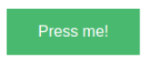
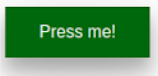
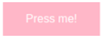
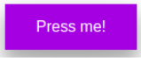
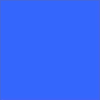
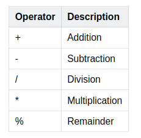

# **Syntactically Awesome StyleSheets**


# **SASS Introductie**

**Wat is SASS en wat kun je ermee?**

SASS staat voor **Syntactically Awesome StyleSheets** en is ruim tien jaar geleden ontwikkeld toen browsers achterbleven in de ondersteuning van de nieuwe CSS-specificatie (CSS3). SASS is een CSS preprocessor: via een conversieslag wordt SASS omgezet naar CSS die elke browser begrijpt. Het voegt extra mogelijkheden toe aan CSS, zoals de mogelijkheid om stijl-definities hiërarchisch in te delen, het gebruik van variabelen, en de toepassing van functies (mixins).

Met SASS is het mogelijk om met behulp van variabelen kleuren en andere eigenschappen van de pagina vast te leggen en deze overal in de stylesheet te gebruiken. SASS-bestanden eindigen op .scss in plaats van op .css, maar worden met behulp van zogenaamde compilers voordat het in de browser verschijnt omgezet naar _native_ CSS. Een browser kan zelf namelijk alleen overweg met CSS-bestanden; het is enkel tijdens de productiefase een handig hulpmiddel om snel, efficiënte code te schrijven.

**De voordelen van SASS**

Hieronder de voordelen op een rij:


* Het geeft overzichtelijke bestanden, met leesbare code
* Wijzigingen in de stijl van een website kunnen snel worden doorgevoerd
* Tijdbesparing door complexe CSS-code achterwege te laten
* Meerdere thema’s voor een website is een stuk eenvoudiger te realiseren
* Een veel betere onderhoudbaarheid

**Waarom Sass?**

Sass is een uitbreidingstaal voor CSS. Met Sass kun je clean, goed onderhoudbare CSS-code schrijven en de veelvoorkomende herhalings- en onderhoudsuitdagingen in traditionele CSS oplossen. Sass volgt het DRY principe. DRY staat voor: Don’t Repeat Yourself. Door goed gebruik te maken van Sass kunnen we veel code hergebruiken. Behalve dat het een waardevolle vaardigheid is voor elke front-end ontwikkelaar, verloopt de overgang van CSS naar Sass behoorlijk soepel dankzij de bekende syntaxis. Om deze reden zullen we de SCSS-syntaxis (Sassy CSS) gaan leren.

**Wat is het DRY principe?**

DRY staat voor Don't Repeat Yourself. Het doel van code DRY schrijven is dat we zo min mogelijk dubbel schrijven door patronen in onze code en styling terug te vinden. Sass volgt dit principe door de mogelijkheid aan te bieden om code eenvoudig te hergebruiken en structuur aan te brengen aan onze styling. Dit principe wordt in veel projecten vereist om styling georganiseerd te houden en om te zorgen dat we zoveel mogelijk onderdelen kunnen hergebruiken in de toekomst. 

**Hoe werkt SASS?**

Sass kan niet rechtstreeks door de browser worden geïnterpreteerd, dus het moet eerst worden geconverteerd of gecompileerd naar gewone CSS voordat de browser het direct kan begrijpen. Compileren verwijst naar het converteren van code naar code op een lager niveau (minder complex), zodat deze kan worden uitgevoerd. Door SCSS naar CSS te compileren, kan het door de browser worden geïnterpreteerd en verschijnen de resultaten op je webpagina.

Voordat je zelf aan de slag kunt met SASS zul je eerst aan je Visual Studio Code een compiler moeten toevoegen. Je kunt hiervoor de extensie Live SASS Compiler gebruiken. Installeer deze op je Visual Studio Code. Zorg er voor dat de SASS Compiler op ‘Watching...’ staat onder in de balk van je VS Code.

Alle SASS code die je nu schrijft in je .scss bestand zal dan automatisch gecompileerd worden naar gewone CSS in een standaard .css bestand.

Om een goede start te maken is het aan te raden om [deze video te bekijken](https://www.youtube.com/watch?v=_a5j7KoflTs&t=153s) en meteen mee te oefenen om SASS beter te leren kennen. Het leert je stapsgewijs alles op te zetten en je leert over de te behandelen onderdelen van SASS.

De officiële documentatie van SASS kun je [hier vinden](https://sass-lang.com/guide). Neem het rustig door.

## **Leerdoelen**

**wat gaan jullie leren?**


* Begrijpen wat SASS is en wat je er mee kunt
* SASS kunnen toepassen
* Met SASS zelfstandig een webpagina kunnen opmaken
* De cursist kan op meerdere manieren een SASS probleem/opdracht oplossen
* De cursist kan een mening vormen over SASS


## **Inhoud**

**1.        Nesting**

**2.        Variables**

**3.        Partials and Modules**

**4.        Mixins and Includes**

**5.        Extend and Inheritance**

**6.        Operators**

<br>

# **Nesting**

Nesting is het proces waarbij selectors binnen het bereik van een andere selector worden geplaatst. In Sass is het handig om het bereik van een selector te beschouwen als de code tussen de accolades die openen en sluiten {}.

Selectors die ‘nested’ zijn binnen het bereik van een andere selector, worden ‘children’ genoemd. De buitenste selector wordt de ‘parent’ genoemd. Dit is net als de relatie die je terugziet bij HTML-elementen. Hieronder een code voorbeeld van nesting en de relatie tussen parent en child.


```
.parent {
  color: blue;
  .child {
    font-size: 12px;
  }
}
```


In het bovenstaande voorbeeld is .child de child-selector en .parent de parent-selector.

De bovenstaande SCSS zou compileren naar de volgende, gelijkwaardige CSS, zie hieronder.


```
.parent {
  color: blue;
}  
.parent .child {
  font-size: 12px;
}
```


Door nesting kun je duidelijk de DOM-relatie tussen twee selectors zien en tegelijkertijd de herhaling verwijderen die in CSS in de code zit.

<br>

## **Opdrachten**

Voor de komende twee SASS onderdelen (Nesting & Variables) zullen we steeds werken met template code. Je kan deze vinden in opdrachten > nesting/variables. Onderdeel van deze template is .scss code - vergeet niet dat je dit dus eerst moet compilen voordat het werkt!

### **Opdracht 1**

Nest de slogan selector in de banner selector en geef de slogan selector de volgende values:


```
  position: absolute;
  border: 4px solid rgb(0, 0, 0);
  top: 200px;
  left: 25%;
  width: 50%;
  height: 200px;
  text-align: center;
```


### **Opdracht 2**

Nest de span selector in de slogan selector en geef de span selector de volgende values:


```
  font-size: 24px;
  line-height: 200px;
```


### **Opdracht 3**

Nest de icon selector in de container selector en geef de icon selector de volgende values:


```
  display: inline-block;
  margin: 2%;
  border: 4px solid black;
  font-size: 32px;
```

<br>

# **Variables**

Met variabelen in SCSS kun je een zogenaamde ‘identifier’ naar keuze aan een specifieke waarde toewijzen. Waarom is dat handig? In tegenstelling tot CSS, als je een value moet aanpassen, hoef je deze slechts op één plaats aan te passen en de wijziging wordt toegepast op alle betreffende regels. Hoe groter je website wordt, des te handiger het gebruik van variabelen is.

In Sass gebruik je de $ om een variabele te definiëren en ernaar te verwijzen. Zie voorbeeld hieronder.

```
$translucent-white: rgba(255,255,255,0.3);
```

<br>

## **Opdrachten**

### **Opdracht 1**

Bovenin je .scss document maak je een nieuwe variabele aan met de naam ‘translucent-white’ en die geef je de waarde ‘rgba(255,255,255,0.3)’.

Zorg er nu voor dat de slogan selector een achtergrondkleur krijgt die je in de bovenstaande variabele hebt gedefinieerd.

### **Opdracht 2**

Er zijn verschillende datatypen die je aan een variabele in SASS kunt toewijzen. Naast het datatype voor kleur dat we hierboven hebben gezien, zijn er ook:

* **_Numbers_**, zoals 8.11 of 12 of bijv. 10px. Merk op dat hoewel 10 een eenheid van px heeft, het nog steeds als een getal wordt gelezen.
* **_Strings_**, met en zonder aanhalingstekens. Enkele voorbeelden zijn "aardappel", 'tomaat' of span.
* **_Booleans_**, of simpelweg ‘true’ en ‘false’.
* **_Null_**, wat als een lege waarde wordt beschouwd.

Maak een nieuwe variabele aan van het type number met de naam icon-square-length en geef die een waarde 300px.

Zorg er nu voor dat de icon selector een width en height krijgt gelijk aan de hiervoor gedefinieerde variabele.

### **Opdracht 3**

Naast _colors_, _numbers_, _strings_, _booleans_ en _null_, heeft Sass nog twee andere datatypen, namelijk _lists_ en _maps_.

Lists kunnen worden gescheiden door spaties of komma's. De volgende twee lists geven bijvoorbeeld font properties aan, zoals:


```
  1.5em Helvetica bold;
```


**en**


```
  Helvetica, Arial, sans-serif;
```


**NB:** Je kunt zelfs een list tussen haakjes zetten en een list maken die bestaat uit lists.

Maps lijken erg op lists, maar bij maps is elk object een key-value paar. Een voorbeeld van een map zie je hieronder.


```
  (key1: value1, key2: value2);
```


Bovenin je .scss document maak je een nieuwe variabele aan van het type list met de naam ‘standard-border’ en geef die een waarde ‘4px solid black’.

Zoek nu alle properties die de waarde ‘4px solid black’ gebruiken in je .scss en vervang ze door de ‘standard-border’ variabele die je zojuist hebt gemaakt. 

**NB:** _Zie je nu dat je eigenlijk al gebruik maakte van lists terwijl je het niet doorhad?_

### **Opdracht 4 - Nesten met de reference selector - the ampersand ( & )**

De ‘&’ is een ontzettend handige feature in SASS. Je gebruikt het bij het nesten. Het kan je veel tijd besparen bij het coderen. Kun jij uitzoeken wat je met de ‘&’ kunt en wat de voordelen ervan zijn? Laat met een voorbeeld zien dat je begrijpt wat het voordeel is van het gebruik van ‘&’ bij het nesten.

<br>

# **3 Partials and Modules**

Binnen Sass kunnen we partials, een afkorting voor partial files, aanmaken. Dit zijn korte Sass codes die we aanmaken om te hergebruiken in andere onderdelen van onze projecten. Zodra de developer gebruik wil maken van styling die hergebruikt kan worden voor andere onderdelen van een website is het altijd een goed idee om hier een partial van te maken. Enkele voorbeelden zijn styling voor: buttons, teksten en foto's. Op de TechGrounds website maken wij hier gebruik van voor de buttons en header styling. Wij willen een uniforme styling voor deze onderdelen zodat de website netjes blijft. Ook is een groot voordeel hiervan dat we de styling maar op één plek hoeven aan te passen zodat het direct ook aangepast wordt op de andere onderdelen van de website. Om juist gebruik te maken van partials plaatsen we een map genaamd 'styling' in de assets of resources map. Deze map maak je als developer vaak aan om verschillende mappen zoals images en fonts in te plaatsen. In de styling map maken wij een bestand aan dat **altijd** begint met een lage streepje _ . We importeren dit bestand als volgt:

```
@import "./assets/button";
```

Door deze regel toe te voegen aan het sass bestand wordt automatisch alle css die wij in dit bestand hebben gezet ingeladen. Voor verschillende pagina’s kunnen wij nu dezelfde stylesheet hergebruiken en uniforme styling toepassen zonder code dubbel te schrijven. 

<br>

## **Opdrachten**

Voor deze opdrachten wordt er weer gebruik gemaakt van een template met meerdere files. Je kan deze vinden in opdrachten > partials.


### **Opdracht 1**

_Om een resultaat op je scherm te kunnen terugvinden zullen we bij opdracht 3 een extra bestand genaamd style.scss gebruiken. In dit bestand zullen we de partials importeren die we willen gebruiken. In ons html bestand linken we vervolgens naar 1 css bestand, style.css ,die gecompileerd wordt uit style.scss. Op deze wijze schrijven we alle styling in losse documenten en importeren wij dit in style.scss met wellicht kleine aanpassingen of toevoegingen. Opdracht 1 & 2 zijn dus voorwerk zonder visueel resultaat voor opdracht 3._


* Navigeer naar het bestand genaamd “_colors.scss”. Hier zullen we enkele variabelen in aanmaken voor de kleur van onze webpagina.  \

* Maak een keuze uit 2 thema-kleuren en twee button kleuren, één voor de reguliere styling één voor de hover, voor je website. \

* Creëer een variabele met de volgende namen:
    * primary-color
    * secondary-color
    * button-color
    * button-hover-color

### **Opdracht 2**

* Navigeer naar het bestand genaamd “_button.scss“
* Creëer hier een button die naar eigen wens gestyled is. Maak gebruik van de button-color variabele die we in opdracht 1 gedefinieerd hebben. 
_(Hint: @import)_
* Maak gebruik van de **&** operator voor de hover styling. 


### **Opdracht 3**

* Importeer in het style.scss bestand onze button. We zullen een soortgelijk resultaat zien:

**Normaal:**



**Hover:**




### **Opdracht 4**

Na het importeren van de button willen we de kleuren van onze button aanpassen zonder onze  standaard button, die wij gedefinieerd hebben in _button.scss, aan te passen. 

* Wijzig de kleuren van de button. Verander alleen de achtergrondkleur bij zowel de reguliere selector als bij de hover. 

Zie hieronder een voorbeeld:

**Normaal:**



**Hover:**



### **Opdracht 5**

Sass zorgt ervoor dat we het DRY principe erg goed kunnen aanhouden. Dankzij de imports van Sass kunnen wij nu onze CSS ook erg goed structureren waardoor alle toekomstige styling code makkelijker terug te vinden wordt. Als opdracht zul je [dit artikel](https://itnext.io/structuring-your-sass-projects-c8d41fa55ed4) moeten lezen. Dit artikel geeft een beeld hoe Sass binnen projecten gebruikt wordt en hoe je je styling goed kan structureren. Zorg ervoor dat je dit artikel onthoudt voor wanneer we in concrete projecten gaan werken.

<br>

# **Mixins and Includes**

Mixin zorgt ervoor dat wij CSS code kunnen schrijven die we kunnen hergebruiken door de website heen. Het verschilt van partials in de zin dat bij partials we een bestand inladen met voorgeschreven CSS classes. Bij een mixin nemen we alleen de properties en values over. Hieronder volgt een voorbeeld: 


```
@mixin important-text {
  color: lightblue;
  font-size: 1rem;
  font-weight: bold;
}

.card-price {
  @include important-text();
}
```


Dit wordt in het CSS bestand gecompiled naar:


```
.card-price {
  color: lightblue;
  font-size: 1rem;
  font-weight: bold;
}
```


We kunnen nu voor elke class waar wij dezelfde styling willen hebben simpelweg @include gebruiken. Als we een deel van de voorgeschreven mixin willen gebruiken kunnen wij de waardes die wij anders willen hebben na de @include overschrijven. Hieronder volgt een voorbeeld.


```
@mixin important-text {
  color: lightblue;
  font-size: 1rem;
  font-weight: bold;
}

.warning {
  @include important-text();
  font-size: 2rem;
}
```


Dit wordt gecompiled naar:


```
.warning {
  color: lightblue;
  font-size: 1rem;
  font-weight: bold;
  font-size: 2rem;
}
```


Binnen CSS wordt **altijd** de laatst aangegeven waarden gebruikt. Alle voorgaande waardes worden overschreven met de laatst ingevulde waarde. De font-size zal dus 2rem zijn ook al geeft de mixin 1rem mee.

Echter is dit niet de meest efficiënte manier om je code te schrijven. Als er variabelen zijn die je vaak zult moeten overschrijven zijn er efficiëntere methodes om te werk te gaan. Zie onderstaand voorbeeld:


```
@mixin important-text($fontsize) {
  color: lightblue;
  font-size: $fontsize;
  font-weight: bold;
}

.warning {
  @include important-text(2rem);
}

.card-price {
  @include important-text(1rem);
}
```


 Dit wordt gecompiled naar:


```
.warning {
  color: lightblue;
  font-size: 2rem;
  font-weight: bold;
}

.card-price {
  color: lightblue;
  font-size: 1rem;
  font-weight: bold;
}
```


We zien dat de CSS code korter is. Er zijn geen dubbele definities. Wij geven in de mixin tussen de () een parameter mee die wij vervolgens gebruiken in de code van de mixin. Hierdoor kunnen we erg flexibel met deze mixin te werk gaan. Een mixin kan ook bestaan uit meerdere mixins.

<br>

## **Opdrachten**

_Ook voor deze opdrachten wordt er weer gebruik gemaakt van een template file. Je kan deze vinden onder opdrachten > mixins._

### **Opdracht 1**

Maak een Sass mixin aan waarbij we een button stylen met de volgende parameters:

* Background-color
* Text kleur
* Background-color op de hover
* Text kleur op de hover

Voor de rest van de button mag je deze naar eigen wens stylen. Zorg dat de button er mooi uitziet.

### **Opdracht 2**

Maak een Sass mixin aan waarbij we een div transition die van kleur verandert on hover met de volgende parameters:

* Begin kleur
* Eind kleur
* Duur



<br>

### **Extend and Inheritance**

De extend feature van Sass is wellicht de belangrijkste feature die Sass met zich meebrengt. Door gebruik te maken van deze feature kunnen we styling van de ene class overdragen naar de andere via een regel code. Hieronder volgt een voorbeeld:

```
%button-basic {
  border: none;
  padding: 15px 30px;
  text-align: center;
  font-size: 18px;
  cursor: pointer;
}

.button-report {
  @extend %button-basic;
  background-color: red;
}

.button-submit {
  @extend %button-basic;
  background-color: green;
  color: white;
}
```

In dit voorbeeld zien we dat we gebruik maken van een % in plaats van een punt voor de button-basic class. Een % staat voor een placeholder selector. Dit betekent dat we deze styling alleen hebben geschreven voor de sass en dat het niet terug zal komen in de CSS. Het zal dus alleen terug te vinden zijn in de CSS waar het gebruikt is en de enige bedoeling hiervan is om het te extenden.

De Sass code compiled in CSS naar:

```
.button-report, .button-submit {
  border: none;
  padding: 15px 30px;
  text-align: center;
  font-size: 18px;
  cursor: pointer;
}
.button-report {
  background-color: red;
}

.button-submit {
  background-color: green;
  color: white;
}
```

We zien hier dat de button-basic selector niet in de CSS staat maar dat de code die daarin stond wel geplaatst is in button-report en button-submit. Vervolgens zien we de toegevoegde code los eronder staan. Door op deze wijze te werk te gaan hoeven we code maar één keer te schrijven en kunnen we het vervolgens hergebruiken waar nodig. Dit volgt het DRY principe. We kunnen ook reguliere classes extenden door simpelweg “@extend .classnaam;” te schrijven. De properties van de class worden dan op dezelfde wijze overgenomen.

<br>

## **Opdrachten**

### **Opdracht 1**

We hebben nu zowel mixins als extends gezien die beiden styling kunnen overnemen. Lees [dit artikel](https://medium.com/stories-from-the-keen/when-to-use-extends-vs-mixins-in-sass-b09d55abd53) en geef een uitleg wanneer we inheritance gebruiken en wanneer we mixins gebruiken.

### **Opdracht 2**

Sass volgt dus het DRY principe. Het DRY principe wordt ook erg mooi meegenomen bij het responsive designen van je website. Om een website responsive te maken met media queries kunnen wij bijvoorbeeld variabelen gebruiken om eenvoud te creëren bij ons responsive design. Lees [dit artikel](https://web.archive.org/web/20200228033323/http://thesassway.com/intermediate/responsive-web-design-in-sass-using-media-queries-in-sass-32) en geef een gecodeerde voorbeeld hoe je hiervan gebruik kan maken in het responsive design. 

**Let op:** Focus op variables in queries. Alle andere onderdelen en methodes zijn ook correct maar zullen wij niet specifiek op focussen om eenvoud te creëren. Als er behoefte is bij de student kan de student deze onderdelen lezen.

<br>

# **Operators**

In CSS kunnen we geen gebruik maken van mathemetical operators. Hiermee bedoelen we tekens zoals: 



Binnen Sass kunnen we hier wel gebruik van maken.  Hieronder volgt een voorbeeld van het gebruik van mathemetical operators binnen Sass.

```
.image {
  height: 400px * 2;
  width: auto;
}
```

Dit compiled naar: 

```
.image {
  height: 800px;
  width: auto;
}
```

We zien hier dat Sass voor ons de wiskundige berekeningen uitvoert. Het verdubbelt de hoogte van de image zonder dat wij deze berekeningen zelf hoeven uit te voeren.

**Let op:**

Het is van belang dat je niet verschillende soorten eenheden door elkaar heen gebruikt. Dit zal leiden tot errors. 

_Voor alle opgaven geldt dat als je verwacht dat de code onjuist is er uitgelegd moet worden hoezo deze code onjuist is en hoe het geschreven zou moeten worden voor een juist resultaat._

<br>

## **Opdrachten**

### **Opdracht 1**

Zie de volgende code en geef aan of geef aan welk resultaat je verwacht:

```
.image {
  height: 400px * 2;
  width: auto;
}
```

### **Opdracht 2**

Zie de volgende code en geef aan of geef aan welk resultaat je verwacht:


```
.image {
  height: 400px + 100;
  width: auto;
}
```

### **Opdracht 3**

Zie de volgende code en geef aan of geef aan welk resultaat je verwacht:


```
.image {
  height: 400px - 300px;
  width: auto;
}
```

### **Opdracht 4**

Zie de volgende code en geef aan of geef aan welk resultaat je verwacht: 

```
.image {
  height: 200px + 100px - 400px;
  width: auto;
}
```

### **Opdracht 5**

Zie de volgende code en geef aan of geef aan welk resultaat je verwacht:

```
.image {
  height: 200px * 3;
  width: auto;
}
```

### **Opdracht 6**

Zie de volgende code en geef aan of geef aan welk resultaat je verwacht:

```
.image {
  height: 750px * 1px;
  width: auto;
}
```

### **Opdracht 7**

Zie de volgende code en geef aan of geef aan welk resultaat je verwacht: 

```
.image {
  height: 30px / 5px;
  width: 24px/ 4;
}
```

### **Opdracht 8**

Zie de volgende code en geef aan of geef aan welk resultaat je verwacht:

```
.image {
  height: (30px / 5px);
  width: (24px/ 4);
}
```