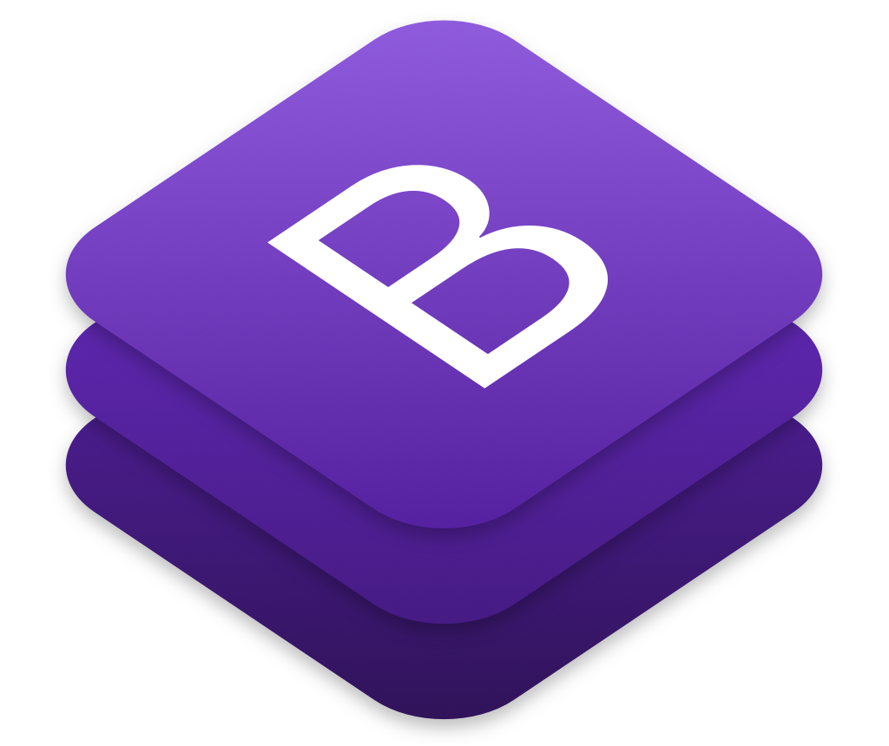
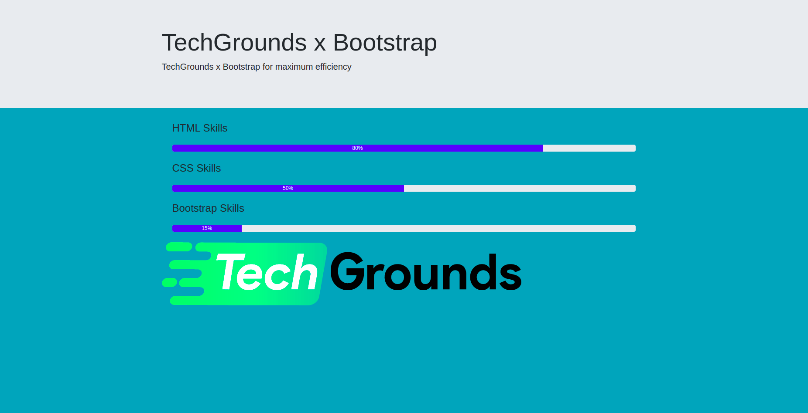
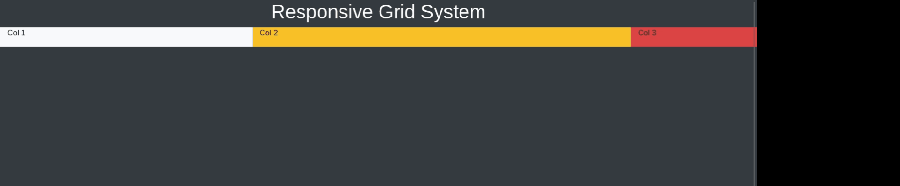

# **Bootstrap**

## **Wat is Bootstrap?**

Bootstrap is één van de meest populaire HTML, CSS en JavaScript frameworks die responsive en mobile-first websites bouwen. Bootstrap is volledig gratis om te downloaden en te gebruiken. Een framework is in principe een collectie voorgeschreven code die jij als developer kan gebruiken zodat je implementaties van andere developers/bedrijven kunt gebruiken. 

Bootstrap is gemaakt door enkele developers die bij het bedrijf Twitter werkten. De developers bij Twitter moesten veel websites bouwen. Echter was er op hun websites geen universele “look”. De websites die gebouwd werden binnen Twitter zelf verschilden erg veel van elkaar. Developers waren vaak bezig met onderdelen opnieuw te coderen die al eerder door iemand anders gecodeerd waren. Door de introductie van dit framework was er universele code die door iedereen gebruikt en aangepast kon worden. 

Uiteindelijk werd dit framework ook beschikbaar als een gratis te gebruiken framework. Deze code is efficient, mobile-first en volledig aan te passen naar eigen wens binnen projecten. Dit zorgt ervoor dat, als een developer goed gebruik maakt van Bootstrap, de developer veel minder code zelf hoeft te schrijven en dus efficiënter en sneller te werk kan gaan. 

## **Wat is een mobile-first website?**

Een mobile first website is een website waarbij als eerst het design en de bruikbaarheid voor mobiele gebruikers in gedachten wordt genomen. Met mobile-first design zorg je ervoor dat op elke scherm van een gebruiker je website goed wordt weergegeven. Hier zet je prioriteiten welke elementen je belangrijk vindt en of deze op je mobiele versie van je website zal worden weergegeven. Op een groter scherm kan je veel meer content weergeven. 

Tegenwoordig is het zo dat meer dan 50% van de internetgebruikers navigeren via hun telefoon. Zie hier de [data](https://gs.statcounter.com/platform-market-share/desktop-mobile-tablet). Dit heeft ervoor gezorgd dat bij het bouwen van een website de developer goed moet bedenken hoe deze elementen weergegeven zullen worden op de mobiele website.

## **Het voordeel van Bootstrap**

* Bootstrap is makkelijk te gebruiken en zodra een developer goed om kan gaan met Bootstrap zal dit één van de belangrijkste skills zijn binnen webdevelopment die de developer kan aanleren. 
* Bootstrap is altijd toe te voegen aan een bestaande website. 
* Bootstrap heeft elementen die gebruik maken van JavaScript zoals een carrousel, modals, alert functies en nog veel meer. Dit zorgt ervoor dat je zelf geen ingewikkelde implementaties hoeft te bedenken en deze direct kunt hergebruiken vanuit Bootstrap.
* Bootstrap is één van de meest gebruikte frameworks en je zult altijd antwoorden op je vragen over Bootstrap online terug kunnen vinden.
* Bootstrap is volledig aan te passen naar eigen wens. Hierdoor kan je aanpassingen maken aan elementen die je hergebruikt uit Bootstrap en het eigen maken.
* Bootstrap is volledig responsive. Als de developer goed gebruik maakt van Bootstrap zal op elk scherm de website mooi weergegeven worden. Websites responsive maken is een onderdeel dat voor velen erg veel tijd kost. Bootstrap versnelt dit gehele proces.

## **Wat kan je met Bootstrap?**

Bootstrap biedt erg veel mogelijkheden binnen HTML, CSS en JavaScript. Enkele belangrijke onderwerpen die je zult moeten beheersen en inlezen om de opdrachten te kunnen maken zijn de volgende:

* Bootstrap Layout, een onderdeel van Bootstrap dat de plaatsing van elementen op verschillende schermen beheerst.

* Bootstrap Grid System, een specifiek onderdeel uit Bootstrap layout dat je website opdeelt in een grid en op die manier onderdelen plaatst.

* Bootstrap Components, voorgebouwde onderdelen van een website die je kunt hergebruiken.

* Bootstrap Layout Utilities, een specifiek onderdeel uit Bootstrap Layout dat ervoor zorgt dat je nog kleine aanpassingen aan de plaatsing van de elementen kan meegeven. Enkele voorbeelden zijn padding en margin.

* Bootstrap Icons, een collectie van Bootstrap Iconen die je direct kunt hergebruiken op je website.

Zorg ervoor dat je voor elk onderdeel de stof goed doorleest en zelf eerst uitprobeert. Het is belangrijk dat je zelfstandig hier een grip op krijgt voordat je aan de opdrachten gaat beginnen. Een aan te raden werkwijze is om te onderzoeken welke Bootstrap Components er zijn en zelf in één pagina alle bovengenoemde onderdelen probeert toe te passen met enkele geplaatste Bootstrap Components. 

 

## **Opdrachten**

Bootstrap is volledig gedocumenteerd met erg veel voorbeelden. Lees voordat je begint aan de opdrachten de documentatie die [hier](https://getbootstrap.com/docs/5.0/getting-started/introduction/) terug te vinden is door. Ga op zoek naar de starter template en plaats deze in een nieuw bootstrap.html bestand. Vervolgens kun je al kennismaken met enkele componenten, dit zijn voorgebouwde onderdelen van een website, van Bootstrap door [hier](https://getbootstrap.com/docs/5.0/components/accordion/) naar toe te gaan. Voel je vrij om voordat je begint aan de opdrachten hier alvast enkele dingen mee uit te proberen.

In het eerste onderdeel van deze opdrachten mag je **alleen** gebruik maken Bootstrap. Je zult een screenshot per opdracht te zien krijgen en zult deze moeten nabouwen met **alleen** Bootstrap. Eigen CSS en JavaScript zijn dus niet toegestaan. Alles wat je nodig hebt aan CSS of JavaScript wordt binnen Bootstrap aangeboden en toegelicht. Je kunt dit dus toevoegen door een Bootstrap class naam toe te voegen of de voorgeschreven waarden aan te passen.

_Let op: Neem het Bootstrap starter template over of importeer handmatig alle benodigde Bootstrap stylesheets en JavaScript files._

### **Opdracht 1**

Bouw het volgende na:

## **Grid System & Responsiveness:**

Nu zul je enkele onderdelen van een website na moeten bouwen die je zullen helpen bij het responsive maken van je websites. 

### **Opdracht 2**

Zorg ervoor dat je 3 tekstblokken aanmaakt met kolommen van gelijke wijdte naast elkaar op een groot scherm. Op een medium scherm passen er maar 2 blokken naast elkaar en op een klein scherm 1 blok per rij. Zie onderstaand voorbeeld:

### **Opdracht 3**

Zorg ervoor dat je een image en een header met een tekstblok naast elkaar plaatst en dat de responsiveness zowel op de kolommen  als op de tekstblokken en images wordt toegepast. Zie onderstaand voorbeeld:

### **Opdracht 4**

Op kleinere schermen wordt het al erg snel moeilijk om meerdere foto's naast elkaar op een goede grootte weer te geven. Hierom maken we gebruik van het Grid Systeem om op verschillende schermen een andere hoeveelheid foto's weer te geven. 

Bouw het volgende responsive design na: 

### **Opdracht 5**

Bouw het volgende na en zorg dat de verhoudingen gelijk blijven bij de verschillende schermen:

### **Opdracht 6**

Bouw het volgende na en zorg dat de kolommen op verschillende schermen anders eruit komt te zien:

### **Opdracht 7**

Het kunnen veranderen van de grootte van bepaalde kolommen op verschillende schermen zorgt ervoor dat wij makkelijk responsive websites kunnen nabouwen. Dit kunnen wij gebruiken voor bijvoorbeeld een responsive blog-website. Op een volledig scherm zou je meerdere posts naast elkaar kunnen plaatsen maar op een klein scherm wordt dit al erg moeilijk. Er volgt nu een website waarbij het nodig is om deze skills nu toe te passen. 

Bouw de volgende website na:

