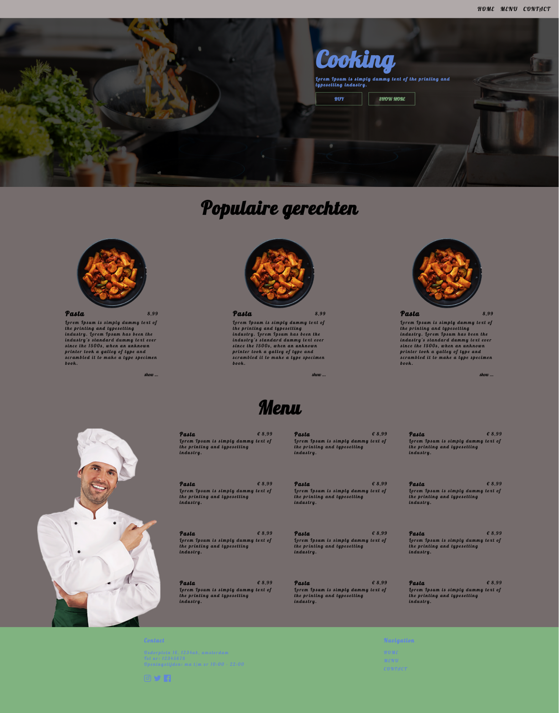

# Onepager

Voor deze oefening ga je een onepager maken - dat is dus een gehele website die bestaat uit een enkele pagina.

Maak gebruik van het volgende:

* Sass
* BEM class naamgeving
* Goede responsiveness
* Je eigen creativiteit :)

De benodigde plaatjes kan je onder "images" vinden. Het resultaat moet er (ongeveer) als volgt uit zien:

