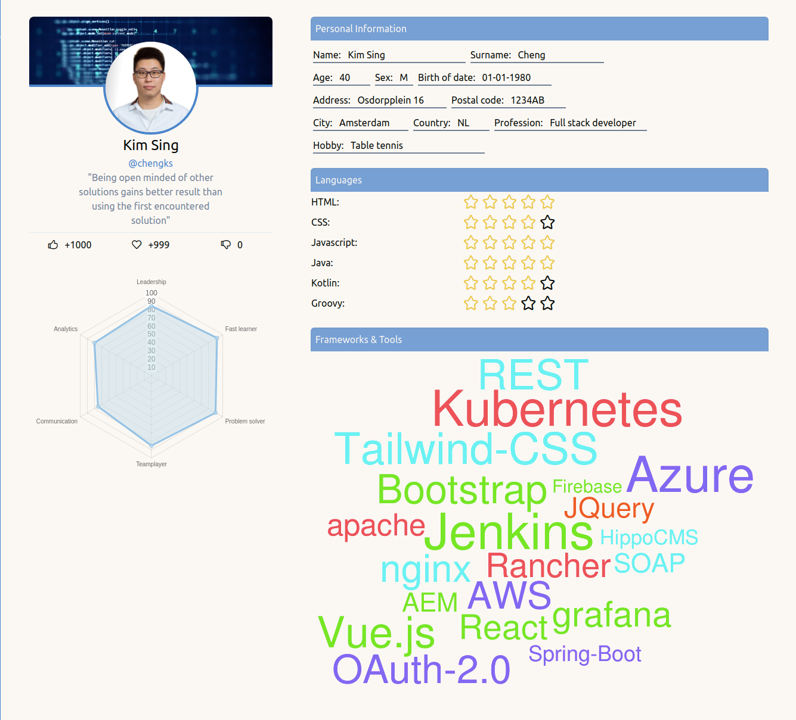

# Portfolio

Voor deze oefening ga je een simpele Portfolio maken. Je hoeft het voorbeeld-design niet precies te volgen, maar hou het wel binnen 1 pagina. Als je een complexere portfolio wil kan je die er later altijd mee uitbreiden.

Maak gebruik van het volgende:

* Sass
* BEM class naamgeving
* Goede responsiveness
* Je eigen creativiteit :)

Voorbeelden van hele mooie portfolio's om je te laten inspireren:

* [http://parabolicplayground.com/](http://parabolicplayground.com/)
* [https://michal-pawelczyk.net/](https://michal-pawelczyk.net/)
* [https://www.becomeknown.co.uk/](https://www.becomeknown.co.uk/)
* [https://mattfarley.ca/](https://mattfarley.ca/)
* [http://www.emilyridge.ie/](http://www.emilyridge.ie/)
* [https://ianlunn.co.uk/](https://ianlunn.co.uk/)
* [https://benadam.me/](https://benadam.me/)
* [https://jonny.me/](https://jonny.me/)
* [https://katydecorah.com/](https://katydecorah.com/)

Het resultaat moet er (ongeveer) als volgt uit zien:

