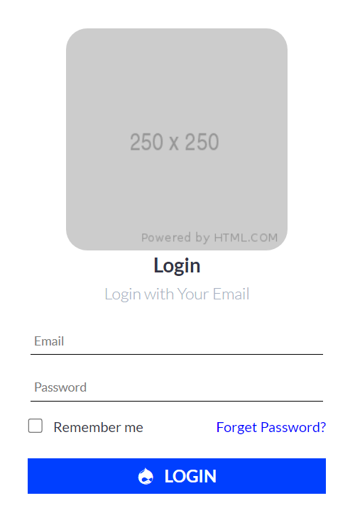
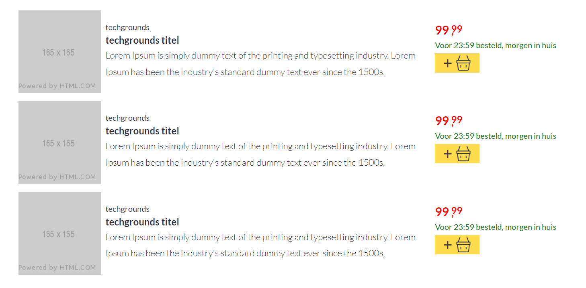
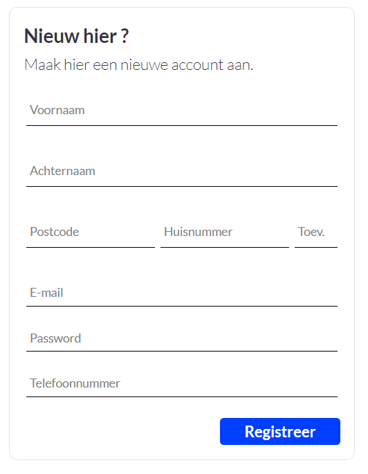
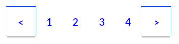
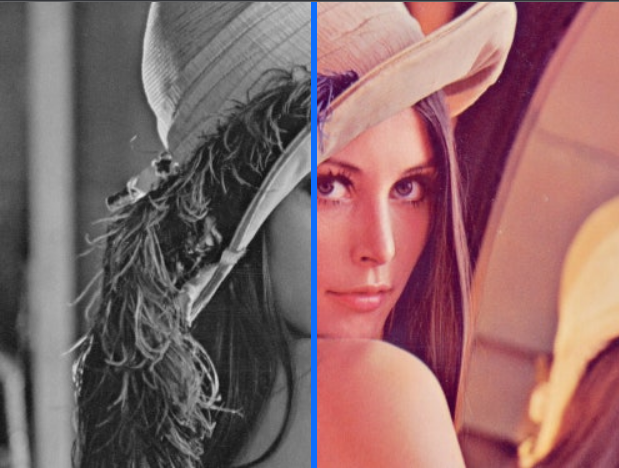
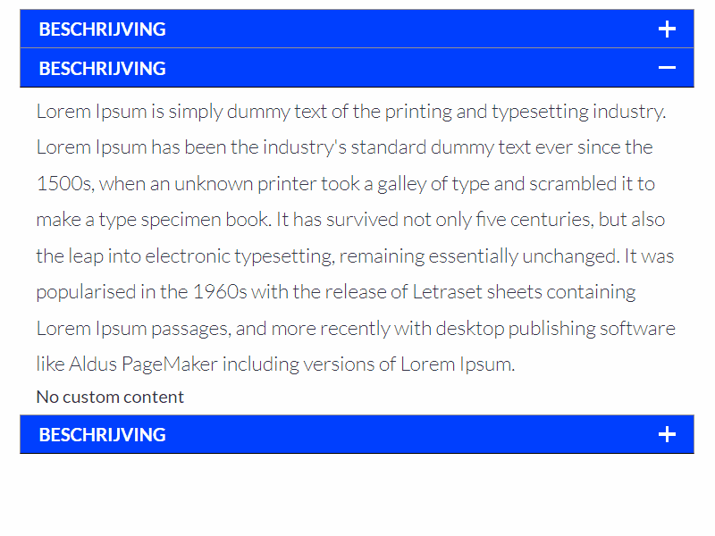
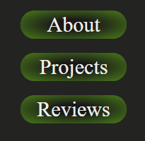
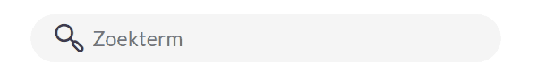

# **Techgrounds CSS Challenge!**

Voor de eindopdracht moet je een aantal componenten van een volwaardige site namaken. **Maak deze opdracht in een aparte branch in je repository.** Je kan na het aanmaken van de branch dan al een pull request aanmaken. Minstens 1 review hierop krijgen is een onderdeel van de **Definition of Done**

Voor deze opdracht zijn er een aantal criteria:

* Alle componenten moeten goed responsive zijn.
* De naamgeving moet helder en consistent zijn!
  * Een goede practice hierbij is [BEM](http://getbem.com/introduction/), snake_case of kebab-case gebruiken.
* Goed gebruik van SASS partials en duidelijke folderstructuur is belangrijk
* Goed gebruik van ARIA is bonuspunten waard :)
* Sommige opdrachten hebben ook nog extra acceptatiecriteria.

# **Verplichte onderdelen:**

### **Navbar**

### **Login**

### **Product Cards**

### **Footer**

# **Optionele Onderdelen**

### **Form**

### **Pagination**

### **Image Overlay**

### **Accordion**

### **Geanimeerde Button**

### **Search Bar**

