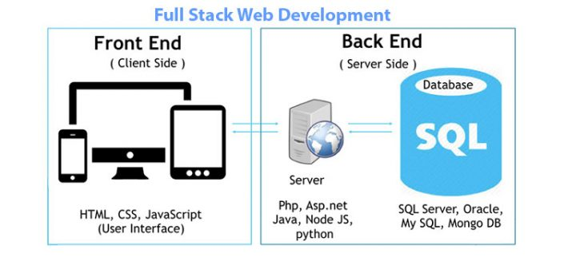

**Getting Started with Java**

# **Introductie**

Java is een van de meest populaire programmeertalen die er is. De naam doet je misschien denken aan JavaScript, maar behalve de naam hebben ze vrij weinig met elkaar gemeen. 

Terwijl JavaScript namelijk vooral gebruikt wordt voor webapplicaties, zit Java in van alles en nog wat. De volgende voorbeelden zijn allemaal met Java gebouwd: 

* Twitter (mobiele app-versie)
* Spotify
* Minecraft

Zelfs de Marsrover _Spirit_ gebruikte software die met Java gebouwd is. Het feit dat Java zo wijdverspreid en veel gebruikt is heeft ook als gevolg dat ontzettend veel bedrijven het al heel lang gebruiken. Meeste bedrijven houden ook vaak lang vast aan oudere IT-oplossingen, omdat alles overzetten naar een nieuw systeem ontzettend veel geld kost. Kortom: Java zit in van alles en je komt het als programmeur overal tegen.

Je bent de termen Server-Side en Client-Side misschien al eerder tegengekomen. Hier is nog een voorbeeld om het iets duidelijker te maken:

Belangrijk om op te merken is dat de database losstaat van de server. De database draaiend houden is dus niet een verantwoordelijkheid van de server. 

Wel is de server verantwoordelijk voor het goed afhandelen van alle verzoeken van de client, en om deze waar nodig ook goed door te geven aan de database. 

## **Hoe werkt het?**

Java is platform-onafhankelijk - code die je schrijft met Java kan draaien op je computer, je mobiele telefoon en dus zelfs op een Marsrover. Dit is dan ook het motto van Java:

_“Write Once, Run Anywhere.”_

De manier waarop Java dit regelt is door gebruik te maken van de **_Java Virtual Machine_**. Dit is een programma wat de Java code “vertaalt” naar instructies die voor de computer te begrijpen zijn. Het vertalen van code wordt ook wel **_compilen_** genoemd.

Dit is een voorbeeld van hoe een compiler werkt:

Voordat je een programma met Java kan gebruiken, moet je computer Java dus hebben geïnstalleerd. Tenzij je een kersverse computer uitpakt, zal dit vaak al het geval zijn. 

Wat ook belangrijk is om hierbij te beseffen, is dat Java verschillende versies heeft. Net zoals andere programmeertalen wordt Java continu verbeterd. Maar een programma dat gemaakt is met een latere versie van Java, kan vaak niet draaien op een computer die alleen een oudere versie geïnstalleerd heeft. Daarom is het heel belangrijk dat je goed weet welke versie je gebruikt.

## **Hoe gebruik ik het**

Om Java te gebruiken als developer heb je twee dingen nodig op je computer:

* de _Java Development Kit_, oftewel de **JDK**. 
    * Dit is een verzameling programma’s die zorgt dat je computer niet alleen Java programma’s kan draaien,. maar ook nieuwe Java applicaties kan creëren.
* een IDE die Java ondersteunt.
    * Tot nu toe heb je gebruik gemaakt van VS Code om je code te bewerken. Zonder plug-ins ondersteunt VS Code Java echter niet. Er zijn twee IDE’s die gericht zijn op Java die veel in gebruik zijn. Dat zijn **_Eclipse_** en **_IntelliJ._** Als je echt heel graag VS Code wil blijven gebruiken is dat mogelijk, maar leren omgaan met (een van) deze 2 programma’s is zeer waardevol voor een back-end developer.

Eclipse kan je hier downloaden:

[https://www.eclipse.org/downloads/](https://www.eclipse.org/downloads/)

IntelliJ kan je hier downloaden:

[https://www.jetbrains.com/idea/](https://www.jetbrains.com/idea/)

_IntelliJ heeft ook een betaalde versie, zorg dat je de gratis (Community) versie installeert._

## **JDK Installatie**

De download-link voor de JDK kan je hier vinden:

[https://www.oracle.com/java/technologies/javase-downloads.html](https://www.oracle.com/java/technologies/javase-downloads.html)

Zoals eerder besproken zijn er dus meerdere versies - download de nieuwste.

Als je nu vanuit de Command Line Interface (dus zonder IDE) probeert Java te gebruiken, zal dit niet goed werken. Dit komt omdat je computer niet automatisch weet waar de instructies voor java commando’s staan. Om te zorgen dat je computer dit wel weet, moet je wat in je settings aanpassen. Hoe je dit doet verschilt nogal per Operating Systeem.

De volgende linkjes leggen allebei stap voor stap uit hoe je dit bij Windows regelt:

[https://www.edureka.co/blog/how-to-set-path-in-java#:~:text=Tools%20like%20javac%20and%20java,to%20set%20the%20path%20beforehand](https://www.edureka.co/blog/how-to-set-path-in-java#:~:text=Tools%20like%20javac%20and%20java,to%20set%20the%20path%20beforehand)

Ook te gebruiken:

[https://www.w3schools.com/java/java_getstarted.asp](https://www.w3schools.com/java/java_getstarted.asp)

Voor macOS en Linux werkt het ietsje anders. Het makkelijkste om te doen is SDKMAN! te gebruiken:

[https://sdkman.io/install](https://sdkman.io/install)