# Intro to JavaScript

JavaScript is de grootste programmeertaal ter wereld, en zeker bij web development is het niet meer weg te denken. Je kan het voor veel verschillende dingen gebruiken - bijvoorbeeld:

* Verwerken van informatie op je pagina
* Versturen van informatie naar een server, zoals log-in gegevens of chatberichten
* Ontvangen en verwerken van informatie van de server
* En het updaten van je webpagina bij al het bovenstaande

Dit soort functionaliteit wordt ook wel **_client-side _**functionaliteit genoemd. Dat houdt in dat het code is die op de computer van de gebruiker wordt gedraaid.

JavaScript is ontwikkeld volgens een bepaalde standaard - **_ECMAScript_**. Deze worden beiden constant geupdate - dit betekent dat er veel manieren zijn om hetzelfde probleem op te lossen. Soms wordt zo’n nieuwe manier veel gebruikt omdat het makkelijker schrijft, maar meestal zijn er wel kleine technische details verschillend.

Elke browser is compatible met een bepaalde versie van ECMAScript. Het kan dus ook zijn dat een nieuwere snellere techniek niet goed bij oudere browsers werkt. Er zijn ook programma’s die jouw “nieuwere” code kunnen vertalen naar “oudere” code.

Je linkt JavaScript aan je HTML via een **&lt;script&gt;** tag - die kan kan je met de src attribute naar je .js file wijzen. Je kan een script tag ook gebruiken om interne JS te coderen.

Deze handout zit vol met voorbeelden. We willen je aanmoedigen om de voorbeelden zelf na te bouwen, zodat je de resultaten in je eigen browser kan controleren. De handout bestaat uit 6 modules met opdrachten en 1 zonder.

# Inhoud

1. Introductie
2. Resources
3. Variables, Datatypes & Operators
4. String Methods
5. Conditions
6. Functions_
7. Arrays & Loops
8. Objects

# Resources

Dit zijn de tutorials en referenties die wij aanraden om JavaScript (en verder) op te pakken:

* **_[MDN Web Docs](https://developer.mozilla.org/en-US/)_** (vroeger Mozilla Developer Network)
    * Dit is de beste technische documentatie van alles wat met Web Development te maken heeft. Het is vanwege al die technische details soms wel lastig te begrijpen. Als je iets uit context niet kan begrijpen, vraag het! 
    * Je kan over elk webdev-gerelateerd onderwerp wel uitleg vinden als je het googled met MDN erachter.
    * Ze hebben ook een super complete tutorial voor beginners: [hier](https://developer.mozilla.org/en-US/docs/Learn)
* **_[W3schools](https://www.w3schools.com/)_**
    * Heeft super complete tutorials met een breed scala aan onderwerpen - van HTML/CSS, beginners EN advanced JavaScript tot Python, SQL en R.
    * Biedt ook certificering
* **_[Grasshopper](https://grasshopper.app/)_**
    * Gemaakt door Google om mensen te helpen leren coderen. Gefocust op JavaScript, maar veel van de dingen die je leert zijn breder toepasbaar.
    * Heeft een goede mobiele app
    * Bevat ook een goede sectie voor Interview-tips
* **_[Web Dev Simplified](https://www.youtube.com/c/WebDevSimplified/featured)_**
    * Heel goed youtube-kanaal wat ontzettend veel onderwerpen op een goede duidelijke manier toelicht. Biedt beginners-vriendelijke uitleg over belangrijke onderwerpen, intro’s voor geavanceerde programmeerconcepten en natuurlijk heel veel video’s met tips & tricks

# Variables

JavaScript gebruikt variables om informatie in op te slaan en te verwerken. Het verzinnen van een passende naam die beschrijft wat voor informatie er wordt opgeslagen is vaak best lastig. Gelukkig kan je deze informatie altijd loggen in de console. Dat ziet er als volgt uit:

In VSCode:

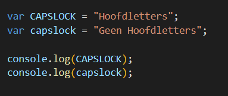

In de browser:

Hier kan je gelijk iets heel belangrijks zien: JavaScript is **_case sensitive_**!

Bij bovenstaand voorbeeld geeft het keyword **_var_** aan dat er een nieuwe variabele wordt aangemaakt. Dit wordt ook wel een declaratie genoemd. Naast var zijn er nog 2 andere soorten variables: **_let_** en **_const_**. Wat de verschillen zijn tussen alledrie ga je bij de opgaven ontdekken.

Elke variabele heeft ook een bepaalde datatype. Weten wat voor datatype er bij een variabele gebruikt wordt is ontzettend belangrijk - gelukkig kan je dat ook met console.log() vinden:

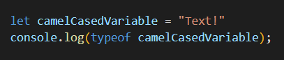

In de console zal dit string tonen. De naamgeving in dit voorbeeld wordt ook wel camelCase genoemd - dat is bij JavaScript standaard.

# Datatypes

Bij JavaScript wordt er onderscheid gemaakt tussen 9 datatypes. 6 daarvan worden ook wel **_primitive datatypes_** genoemd. Dit zijn:

* number  	    -> een getal
* string 		-> een stuk tekst
* boolean 	    -> is altijd true of false
* undefined 	-> geen waarde toegekend
* bigint 		-> voor hele grote getallen
* symbol		-> voor unieke waarden

De laatste twee hiervan worden weinig gebruikt. De overige drie datatypes zijn:

* null		
* object	
* function

Bij JavaScript wordt het datatype van een variabele automatisch toegewezen. Toch is het heel belangrijk om goed te beseffen wat voor datatype er in een variabele zit - als dat iets onverwachts is kan je code dus ook heel rare resultaten tonen.

Al deze informatie in datatypes en variables wil je dus ook kunnen veranderen. Dit doe je met **_operators_**. De symbolen hiervoor ben je al lang mee bekend, maar wat ze bij JavaScript doen kan net iets anders zijn dan je verwacht.

Er zijn vrij veel operators en meeste ervan zijn vrij makkelijk te begrijpen, dus we gaan ze hier niet allemaal benoemen. Toch zijn er enkele nieuw of lastig die jullie tegen zullen komen:

* "=="		-> gelijke waarde
* "!="		-> ongelijke waarde
* "==="		-> gelijke waarde EN gelijk datatype
* "!=="		-> ongelijke waarde OF ongelijk datatype
* "++"		-> increment
* "--"		-> decrement
* "%"		-> modulo: 10 % 3 = 1

Een enkel = teken signaleert dat je een bepaalde waarde ergens aan toewijst, terwijl twee of meer == tekens een vraag aangeven die true of false kan zijn. Het antwoord op zo’n vraag is altijd een boolean.

# Variables & Datatypes - Opdrachten

### **Opdracht 1.1:**

We onderzoeken het verschil tussen var, let en const. Gegeven zijn een aantal voorbeelden - schrijf eerst je verwachtingen op voordat je ze zelf nabootst. Kijk vervolgens wat er bij jou in de console gelogd wordt - is dat wat je verwachtte? Zo nee, deel het dan aan het einde van de dag met je groep.

a)

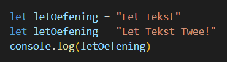

b)

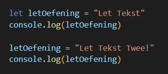

c)

d)

### **Opdracht 1.2:**

We onderzoeken de verschillende datatypes.

Gegeven de volgende code:

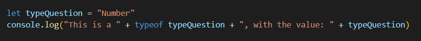

1. Wat zie je in de console? Was dat wat je verwachtte?
2. Vervang bij het voorbeeld “Number” door de volgenden:
    * true
    * false
    * undefined (als je ‘= “Number”’ in zijn geheel weghaalt doet dat hetzelfde)
    * 22
    * 22n
    * Symbol()
    * null
    * {}
    * new Object();
    * function calculateSomething() {}

### **Opdracht 1.3:**

Gegeven de volgende code:

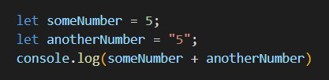

1. Wat komt hier uit?
2. Wat komt er uit als je van beiden een number maakt?
3. Wat komt er uit als je de + vervangt door:
    * "=="
    * "==="
    * "!="
    * "!=="

### **Opdracht 1.4:**

We gaan operators wat nader onderzoeken, en ermee experimenteren.

1. Wat komt er uit het volgende?

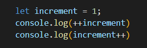

2. Wat komt er uit als je de console.log() hierboven omdraait?
3. Wat komt er uit het volgende?

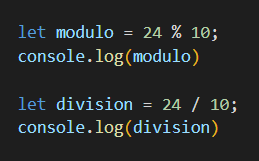

4. Wat komt er uit het volgende? (spaties toegevoegd voor helderheid)

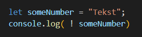

5. Wat komt er uit bovenstaand als je de waarde van someNumber verandert in:
    * 5
    * Boolean
    * false
    * “false”
    * true
    * “true”
    * null
    * undefined
6. Zoek op of experimenteer wat "+=" doet. Werkt deze ook met Strings? Weet je hoe je deze anders kan schrijven?
7. Doe hetzelfde voor "-=", "*=", "/=", "%=" en "**=".

# String Methods

Misschien viel het je bij Opdracht 1.2 al op dat het datatype object vaak voorkwam. Dat is geen toeval. Onder de motorkap maakt JavaScript van vanalles en nog wat een Object - zelfs Strings worden automatisch omgezet naar Objects, zodat je er bepaalde functionaliteit mee kan gebruiken. Om die functionaliteit te begrijpen moet je eerst goed snappen wat een JavaScript Object is. 

Objects zijn in JavaScript documentatie te herkennen aan het feit dat ze beginnen met een hoofdletter. Datatypes worden juist beschreven met kleine letters.

Een Object bestaat uit properties met bepaalde waarden, zogenoemde **_key-value pairs_**. Verder kunnen Objects ook ingebouwde functies hebben - dat zijn functies die het Object op zichzelf kan uitvoeren, om zo een ander resultaat terug te geven.

Ook een String Object heeft dus methods, en 1 (belangrijke) property - lengte. Veel van deze methods gebruiken een index om aan te geven op de hoeveelste plek een bepaald teken staat. **_De index begint bij 0! _**

De string “Leuk idee!” heeft dus een lengte van 10

* Op index 0 staat L
* Op index 4 staat een spatie (ook wel whitespace genoemd)
* Op index 9 staat een !

Een lijst met alle String methods kan je [hier](https://developer.mozilla.org/en-US/docs/Web/JavaScript/Reference/Global_Objects/String) vinden. De belangrijkste zijn:

* charAt()
* concat()
* includes()
* indexOf() en lastIndexOf()
* replace() en replaceAll()
* split()
* substring() en slice()
* toLowerCase() en toUpperCase()

split() gebruikt een Array om het resultaat te tonen - dat is niets meer dan een lijstje. Later gaan we daar meer op in.

substring() en slice() lijken heel erg op elkaar, maar werken net iets anders. Let op - er is ook een verouderde method substr() die WEER net iets anders werkt - deze wordt nog wel ondersteund maar niet meer gebruikt.

# String Methods - Opdrachten

### **Opdracht 2.1:**

Gegeven de volgende String:

1. Splits de String met een string method op in 2 aparte zinnen. Stop beiden in een aparte variabele.
2. Zo’n geweldig nieuws verdient upper case. Zet someKittens om naar hoofdletters.
3. Geef de eerste en laatste index van het woord “kittens” in de variabele someKittens.
4. Gebruik charAt() op beiden. Welk teken krijg je terug?

### **Opdracht 2.2:**

substring() en slice() lijken erg op elkaar. We onderzoeken de verschillen. Test dit met een eigen string, of gebruik het vorige voorbeeld.

substring() en slice() kunnen 2 waardes meegegeven worden - een index waar de nieuwe waarde begint en een index waar deze moet eindigen.

1. Wat doet substring() als het eerste getal hoger is dan het tweede getal?
2. Wat doet slice() als het eerste getal hoger is dan het tweede getal?

Deze waardes hoeven niet per se positief te zijn - je kan ook negatieve getallen meegeven.

3. Wat doet substring() bij negatieve waardes?
4. Wat doet slice() bij negatieve waardes?

### **Opdracht 2.3:**

Gegeven het volgende voorbeeld:

Gebruik split() om alle woorden apart in een Array te zetten.

# Conditions

Conditions liggen aan de grondslag van alle logica. Bijvoorbeeld:

* Je wil je site pas tonen als mensen goed ingelogd zijn. 
* Je wil de pagina niet herladen als iemand op de navigatie drukt van de pagina waar ze op zijn. 
* Je wil dat het formulier niet verzendt als er informatie mist.

Bij al dit soort acties is er dus een bepaalde voorwaarde die voldaan moet zijn. Die acties en voorwaarden kan je op 3 verschillende manieren uitschrijven:

* If, Else & Else If
* Switch
* Ternary Operator.

Een If blok heeft een bepaalde (voorwaarde) en een bepaalde {actie} die met verschillende brackets worden aangegeven. Dat ziet er als volgt uit:

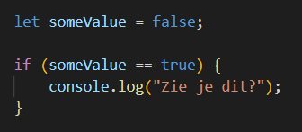

**Let op de twee == tekens!** Zoals het hierboven geschreven staat wordt er niks in de console gelogd - (someValue == true) klopt niet - de waarde is dus false. Als je dit met een enkel = teken zou schrijven, ken je de waarde true toe aan someValue. Zoals je bij Opdracht 1.4 misschien al hebt gemerkt, wordt ook zo’n toekenning door JavaScript gezien als true of false. Zorg dat je goed onderzoekt wanneer je voorwaarde true of false kan zijn!

Je kan zelfs variabelen zonder operators aan een conditie meegeven:

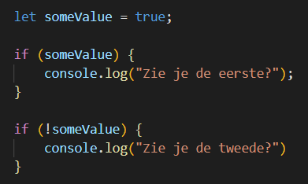

Soms wil je meerdere acties ondernemen afhankelijk van dezelfde voorwaarde. Je kan dit natuurlijk doen met meerdere If blokjes, zoals bij het vorige voorbeeld. Als je de voorwaarde omdraait met een ! kunnen ze nooit beiden waar zijn. 

Toch is er een nettere manier om dat uit te schrijven - met If/Else:

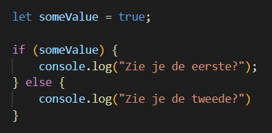

Met een If … Else … geef je dus geen optionele code meer aan. Als de conditie niet klopt, wordt de eerste code uitgevoerd, en anders de tweede. Je kan dit zien als een splitsing op een pad - als je verder wil moet je 1 van de 2 kiezen en daarin verder.

Als je dit soort logica in het Nederlands uitschrijft:

* Als (waar) dan (code). Als (onwaar) dan (code).	2 If … blokjes
* Als (waar) dan (code) anders (code)			1 If … Else blokje

Toch is er nog een laatste optie die je met If blokjes kan gebruiken:

* Als (voorwaarde) dan (code) anders ALS (voorwaarde) dan (code)
* Als (voorwaarde) dan (code) anders ALS (voorwaarde) dan (code) anders (code)

Het gaat dus om extra voorwaarden stellen die gevraagd worden **_als er niet aan de eerste voorwaarde voldaan is_**. Dit ziet er zo uit:

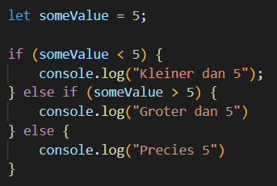

Je kan ook meerdere else if (...) {code} achter elkaar hangen. Het is wel heel belangrijk om te beseffen dat de latere condities/code pas worden gecontroleerd/uitgevoerd als de eerdere condities/code niet kloppend/uitgevoerd is.

Je kan alle mogelijke condities met If/Else uitschrijven. Een probleem dat je daarbij wel tegenkomt, is dat het bij complexe logica erg lang en onoverzichtelijk wordt. Ook is If/Else niet heel erg snel. Om dat op te lossen is de Switch bedacht:

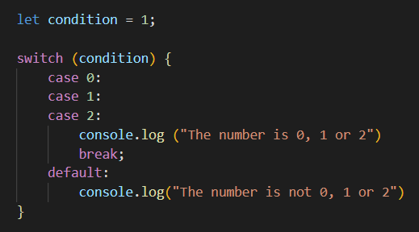

Hierboven zie je een complete Switch. Die kijkt dus 1x naar de conditie, en geeft vervolgens meerdere mogelijkheden. Hierdoor is een Switch niet alleen overzichtelijker maar ook een stuk sneller dan een If/Else blok. Toch zijn er ook een paar punten waar ze verschillen:

* Een If/Else voert altijd 1 code-blok uit, en negeert de rest. Een Switch gaat rustig door naar de volgende case ook als hij een passende heeft gevonden. Een Switch stopt pas bij een “break;”, of als hij bij de laatste case is aangekomen.
* Een case kan geen wiskundige operators gebruiken. Je kan in de conditie wel “someNumber &lt; 5” zetten, maar de case zelf is dan true/false. 
* Switch is altijd sneller dan If/Else, al helemaal bij grote If/Else

Een Ternary Operator is eigenlijk hetzelfde principe - het is een andere manier om meerdere regels aan If/Else te schrijven, die sneller en overzichtelijker werkt. 

Normale operators werken met 1 of 2 waardes: a++, a + b, a = b etc. De Ternary Operator is de enige die met 3 werkt, en altijd in de volgende vorm: 

* “a ? b : c”
* Ook wel: “Voorwaarde ? Waar : Onwaar”

Je zet dus voor een vraagteken een conditie en daarna de code die wordt uitgevoerd als de conditie klopt. Vervolgens een dubbele punt gevolgd door de code die wordt uitgevoerd als de conditie NIET klopt.

Een voorbeeld:

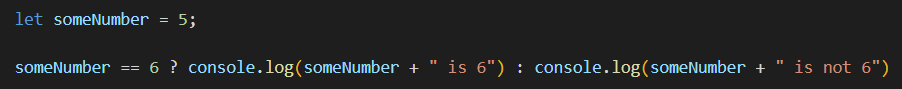

# Conditions - Opdrachten

### **Opdracht 3.1:**

Conditions werken erg vaak met operators. Om goed met conditions te kunnen werken, moet je operators echt goed begrijpen. Daarom onderzoeken we ze hier nogmaals:

1. Wat is het verschil tussen == en ===?
2. Wat is het verschil tussen > en >=? En tussen &lt; en &lt;=?

Soms controleert een conditie meerdere dingen tegelijkertijd. Dit doet met de hulp van **_Logical Operators_**:

* &&		EN
* ||		OF
* !		    NIET

Soms worden deze in combinatie gebruikt. Gegeven volgende code:

3. Schrijf de If conditie zo, dat je alleen “Result!”  ziet als x==4 en y==8
4. Schrijf het nu zo dat je alleen “Result!” ziet als x==4 OF y==8
5. Zet nu de console.log(“Results”) in een Else { } na de If. Kan je de conditie omdraaien zodat je alsnog “Results!” te zien krijgt?
6. Kan je het vorige antwoord ook geven zonder || te gebruiken?

Schrijf voor de volgende opdrachten 1 If/Else die 1 variabele waarde controleert, en zorg voor het volgende:

7. Log het in je console als de waarde groter dan 5 EN kleiner dan 10 is.
8. Zo niet, log dan in je console als de waarde 11 of groter EN 20 of kleiner is.
9. Zo niet, log dan in je console als de waarde 21 of 23 is.
10. Zo niet, log dan in je console als de waarde kleiner dan 35 OF tussen de 40 en 45 is.
11. Test of je bij alle uitkomsten kan komen. Verandert er iets als je alle If/Else omzet in aparte If blokken?

### **Opdracht 3.2:**

We oefenen nog wat extra met grotere If/Else blokken, Switch/case en Ternary Operators.

1. Schrijf een If/Else blok die een eigen variabele controleert:
    * Gelijk aan 3?
    * Groter dan 4?
    * Groter dan 11?
    * Kleiner dan 3?
2. Test je variabele met 2, 3, 4, 5 en 20. Gebeurt er iets onverwachts?
3. Schrijf een If/Else die een variabele op numerieke waarde controleert, en de passende maand in je console logt.
    * Januari
    * Februari
    * Maart
    * April
    * Mei
    * Juni
    * Juli
    * Augustus
    * September
    * October
    * November
    * December

	Andere getallen loggen (“Geen geldige maand!”).

4. Bouw nu opdracht C met een Switch/case.

Gegeven de volgende code:

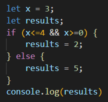

5. Herschrijf dit als een Ternary Operator.

# Functions

Tot nu toe heb je al je code zelf laten draaien zodra de pagina geladen wordt. Maar JavaScript wordt pas echt nuttig, als je functionaliteit af laat hangen van je gebruiker. Zodra die op een knopje drukt, iets invult, of zelfs maar iets met de muis doet kan je die functie oproepen en laten draaien.

Daarvoor moet je dus niet alleen code schrijven die wat doet, maar ook die code koppelen aan een actie van de gebruiker. Dat koppelen kan op 3 manieren gebeuren - de allersimpelste hiervan is via de HTML attribuut onclick of onchange:

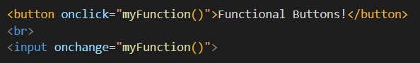

Later ga je ook over de andere 2 manieren leren, maar dat laten we nu nog even.

De functie zelf zit natuurlijk gewoon in je JavaScript file (of script tags):

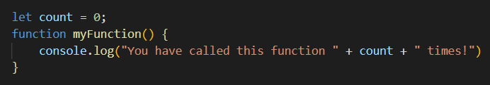

De naam is vrij zeggend bij onclick en onchange. De eerste is verreweg de belangrijkste, maar daarnaast zijn oninput en onsubmit ook nog best handig om te kennen. Er zijn nog heel veel meer van dit soort **_events_** - later volgt daar meer over.

Functies kunnen ook informatie van een of meer variabelen meekrijgen. Zo’n variabele wordt ook wel een **_parameter_** genoemd. Dat ziet er als volgt uit:

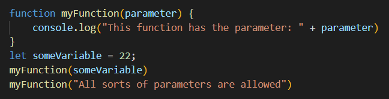

De variabele “parameter” heet dus alleen zo binnen de functie zelf. Natuurlijk kan je een functie ook een variabele van buitenaf laten gebruiken - dat hebben we bij het vorige voorbeeld gezien. 

Je parameters hoeven trouwens niet parameter te heten, dat is hier alleen om het uit te leggen. Vaak verwijzen ze naar het doel waar ze voor gebruikt worden, maar helaas noemen sommige luie programmeurs ze a, b, c etc. Hopelijk doen jullie dat beter!

Een functie kan ook meerdere parameters hebben:

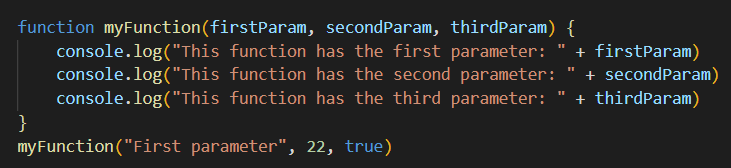

Soms wil je ook rekening houden met een onbekend aantal parameters. Wil je dat doen, dan moet je Rest Parameters gebruiken:

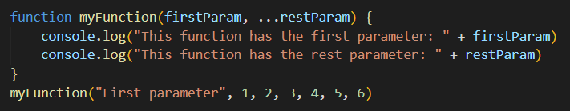

Rest Parameters zijn altijd als laatste in de naam van de functie, en worden aangegeven met de … ervoor. Het resultaat wordt opgeslagen in een Array - later volgt daar meer over.

Met parameters kan je dus zorgen dat een functie wordt opgeroepen en iets meegegeven krijgt. Maar een functie kan ook iets teruggeven! Dat ziet er zo uit:

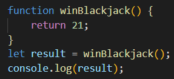

Het belangrijkste van functions heb je hiermee gehad. Toch gaan we nog even wat verder met 4 onderdelen die bij functies veel gebruikt worden:

* Functies pauzeren met debugging tools
* Elementen op de pagina via het document selecteren
* het keyword **_this_**
* Functies anders schrijven met arrow functions.

Als je een functie halverwege wil pauzeren kan dat door in je IDE **_breakpoints_** te zetten.  Hiermee kan je controleren wat voor waardes er in je variabelen zitten. Het keyword **_debugger_** doet hetzelfde als een breakpoint:

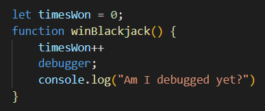

Hiermee stop je de functie voordat de console iets logt. Als je nu met de console open de functie aanroept, krijg je het debugging window te zien. Onder Scope > Strict kan je bij dit voorbeeld de waarde van timesWon inspecteren. De debugger wordt hier niet verder uitgelegd, maar we willen je wel aanmoedigen er verder mee te experimenteren - het is een heel sterk hulpmiddel!

Stel je hebt 2 buttons waarvan je de titel wil gebruiken in je code. Als je net begint kan dit er zo uit zien:

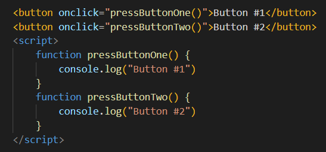

Met 2 buttons valt dit nog best te doen, maar als je pagina uit tientallen interactieve elementen bestaat is dat toch een stuk lastiger. Daarom ga je met JavaScript elementen selecteren uit de **_DOM_**, het **_Document Object Model_**.

Als je HTML/CSS een blauwdruk is, dan is de DOM wat je browser ermee bouwt. Het is een kopie van je pagina-layout vol met extra informatie over allemaal onderdelen, die je natuurlijk met JavaScript ook weer aan kan passen.

Via de DOM kunnen we dus rechtstreeks informatie over de buttons in onze code verwerken:

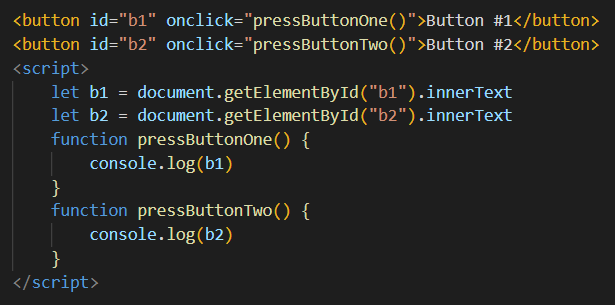

Hiermee hebben we onze zelfgeschreven console logs vervangen door iets schaalbaars, maar we moeten nog steeds aparte IDs, variabelen en functies voor elke button schrijven. Kon dat maar makkelijker…

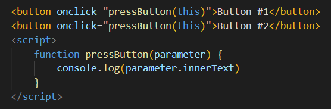

Let op - **_this_** kan heel verwarrend werken. Als ik** “dit!”** zeg en naar mezelf wijs, is dat nog wel duidelijk. Maar als ik jou vraag hetzelfde te doen voor mij, weet jij welke **“dit!”** ik dan bedoel? Daarom is het heel belangrijk dat je bij gebruik van **_this_** heel goed alle mogelijke waardes test, via console.log en/of de debugger.

Tenslotte zijn er ook nog Arrow Functions. Dit zijn functies zonder naam, die sneller en korter geschreven kunnen worden. Technisch is er enig verschil, vooral bij combinatie met **_this_**.

Een Arrow Function ziet er als volgt uit:

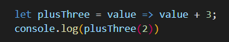

Hierboven  staat praktisch hetzelfde als:

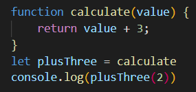

Omdat het korter geschreven is, worden Arrow Functions dus ontzettend vaak gebruikt. Het is nog niet nodig om alle technische details te begrijpen, maar het zal je enorm helpen om de syntax WEL goed te kennen. 

Er zijn ontzettend veel luie programmeurs die liever 1 regel typen dan 4. Als je Arrow Functions goed begrijpt zal dat erg veel helpen met hun code ontcijferen!

Meer weten over Arrow Functions? Lees je in op [w3schools](https://www.w3schools.com/js/js_arrow_function.asp) of via [MDN](https://developer.mozilla.org/en-US/docs/Web/JavaScript/Reference/Functions/Arrow_functions).

# Functions - Opdrachten

### **Opdracht 4.1:**

We gaan functies oefenen door bij het begin te beginnen:

1. Maak een button en verbind er een functie aan. Zorg ervoor dat de functie in de console “Hello World” logt.
2. Maak een input element en geef het een bepaald ID. Sla dat ID op in een variabele via document.GetElementByID().
3. Maak een functie die een parameter in de console logt. Geef je input element vervolgens een _onchange_ attribuut die deze functie aanroept. Natuurlijk wil deze functie ook een parameter gebruiken - gebruik hiervoor de ID variabele uit de vorige vraag. Test het vervolgens door wat bij je input in te typen.
4. Geef je functie een return waarde, bijvoorbeeld de parameter * 2. Maak vervolgens een nieuwe variabele “result”. Roep je functie op met een getal als parameter en wijs de return waarde toe aan “result”. Log de variabele daarna in je console.

### **Opdracht 4.2**

We gaan een paar veelgebruikte DOM methods onderzoeken. Je bent inmiddels bekend met document.GetElementById(). Veel andere DOM methods geven Arrays terug - je hebt het inmiddels al vaker gelezen maar hoe je die verwerkt gaan we later nog leren :)

1. Onderzoek de volgende DOM methodes en gebruik ze in een voorbeeld:
    * document.getElementsByClassName
    * document.getElementsByTagName
    * document.querySelector
    * document.querySelectorAll
    * element.innerHTML
    * element.innerText
2. Bij opdracht 4.1c heb je een input als parameter meegegeven. Roep die functie nu aan met een _oninput_ ipv _onchange_, en console.log() de parameter.value ipv de parameter. Zie je de verschillen als je nu wat intypt?

### **Opdracht 4.3:**

Eerder heb je kennis gemaakt met het String object en de built-in String Methods. Nu gaan we kennismaken met nog zo een - het Math object. Het Math object heeft namelijk ook methods die bij functies erg veel gebruikt worden:

1. Maak een functie randomNumber() en verbindt die aan een button. Zorg dat de functie Math.random() in de console logt. Wat merk je op als je deze meerdere keren gebruikt?

Math.random() geeft dus een getal 0 >= x &lt; 1 terug - het kan wel 0 zijn, maar nooit 1. Als je die laat afronden met Math.round(), zal het vaker afronden naar beneden dan naar boven.

Als je een willekeurig getal wil tonen, moet je Math.floor() gebruiken op Math.random(). Als je dit zo doet, krijg je altijd 0 terug.

2. Verander je functie nu dat hij een parameter x gebruikt, en zorg dat hij het volgende in je console logt: Math.floor(Math.random() * x). Test nu je functie met verschillende waardes voor x. Valt iets je op?

Als je meer wil inlezen over het Math object, kan je dat doen via [w3schools](https://www.w3schools.com/js/js_math.asp) of [MDN](https://developer.mozilla.org/en-US/docs/Web/JavaScript/Reference/Global_Objects/Math).

3. Er zijn nog 2 belangrijke Math methods die handig zijn om te kennen. Onderzoek wat Math.min() en Math.max() doen. Kan je van beide al een voorbeeld geven?

### **Opdracht 4.4:**

We eindigen deze oefeningen met een lastige:

1. Schrijf een functie waar je een naam aan mee kan geven. Laat de naam vergelijken met de namen van mensen in je groepje. Wanneer je functie de naam wel/niet herkent moet dat als boodschap teruggegeven worden.
2. Schrijf een 2e functie die de eerste functie aanroept, en vervolgens de teruggegeven boodschap in een div element op je pagina toont. Denk aan de DOM methods!
3. Schrijf nu het bovenstaande nogmaals, maar gebruik dit keer Arrow Functions. Als het niet overal lukt is dat niet erg! 

# Scopes

De _Scope_ van een variabele slaat op de plekken waar die herkend wordt. Er bestaan 2 soorten scopes:

* Global Scope (Script Scope valt hier ook onder)
* Local Scope

De scope hangt af van het gebruikte keyword en of het binnen _{ curly brackets }_ gedeclareerd wordt. Meestal is dat een functie of if/else blok, maar je kan ze ook zelf creëren:

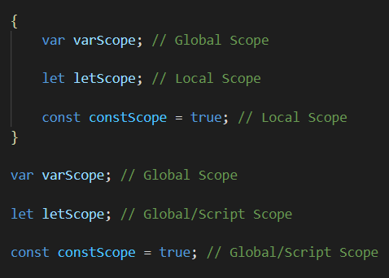

Var is een oude manier van variabelen aanmaken - tegenwoordig wordt het vermeden ivm veiligheidsrisico’s. Als je dan toch een variabele buiten _{ Local Scope } _nodig hebt, houden const/let ze in **_Script Scope_**. Dat doet voor je code hetzelfde en is een stuk veiliger.

Als je **_geen_** keyword gebruikt bij het aanmaken van een variabele, maakt JavaScript er automatisch een _var_ van. Dit is dus heel gevaarlijk! Declareer veilig, declareer let of const.

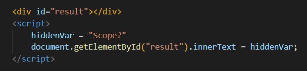

# Arrays

Een Array is een soort datatype. Het is een manier om meerdere variabelen bij elkaar te groeperen - eigenlijk kan je een Array zien als een lijstje. Je herkent een Array aan de vierkante brackets [ ]:

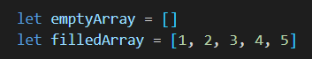

Elk item in een Array heeft een bepaalde**_ index_**. De index is een getal dat aangeeft op welke plek in het Array een bepaald item staat. Als je het hele array in je console logt, krijg je de hele lijst te zien. Als je alleen 1 item uit het array wil tonen, moet je de index gebruiken:

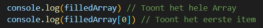

Een JavaScript Array begint te tellen vanaf 0. Dit is voor nieuwe programmeurs vaak erg verwarrend. Als je het eerste item wil tonen, gebruik je dus de index 0! 

Je kan ook verschillende soorten datatypes in hetzelfde Array gebruiken. Je kan zelfs Arrays in andere Arrays zetten! Dan wordt het een **_Nested Array_** genoemd:

Net zoals Strings zijn Arrays stiekem ook Objects. Dat betekent dat het ook de length property en built-in methods kan gebruiken. Built-in Array methods gaan we later bestuderen.

# Loops

Loops zijn een manier om code meerdere keren te laten uitvoeren. Ze worden erg vaak gebruikt in combinatie met Arrays - als je een bepaalde actie op elk item in een Array wil uitvoeren, kan je dus door het Array _loopen_.

JavaScript heeft 5 verschillende loops, waarvan enkele erg veel op elkaar lijken:

* For Loop
* For .. In Loop & For … Of Loop
* While Loop & Do … While Loop

De bekendste is dus de For Loop. Die ziet er als volgt uit:

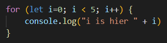

Wat je hierboven ziet bestaat uit 4 onderdelen. Je hoeft deze namen niet te onthouden, zo lang je maar begrijpt wat ze doen:

* **_let i=0_** - Een variabele i wordt gedeclareerd en de waarde 0 gegeven de**_ initialisatie_**
* **_i &lt; 5_** - Die variabele wordt geëvalueerd naar true/false: de **_conditie_**
* **_i++ _**- Een actie die wordt uitgevoerd aan het einde van elke loop - de **_final expression_**
* **_console.log() _**- De actie(s) die de loop moet uitvoeren heten ook wel een **_statement_**

Vergeet de **_semicolons (;)_** niet! Je kan de variabele i overigens best een andere naam geven. Zo’n variabele die in een for loop aangemaakt wordt heet ook wel een **_iterator. _**Een enkele uitvoering van de loop wordt ook wel een **_iteratie_** genoemd. Tegenwoordig is dat gewoon afgekort naar de variabele i.

Je hebt ook for ... in en for … of loops. Die zien er zo uit:

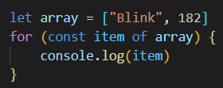

Snap je het verschil al? Probeer ze beiden zelf!

Tenslotte zijn er ook nog de while en do … while loops. Een while loop ziet er zo uit:

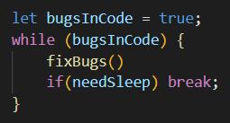

Een while loop heeft alleen een conditie nodig die true/false kan zijn. Zo lang die conditie waar blijft wordt de statement herhaaldelijk uitgevoerd. 

Als je conditie in de loop nooit verandert, wordt deze dus oneindig uitgevoerd. Om te voorkomen dat je browser crasht kan je het **_break_**. Je hebt deze al bij switch gebruikt zien worden, maar ook in loops kan je je code ermee stopzetten.

Heel vergelijkbaar is ook het keyword **_continue_**:

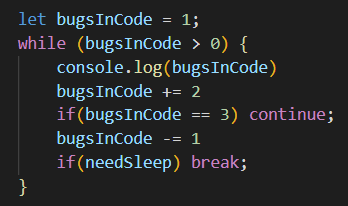

Continue stopt de huidige iteratie en gaat met de volgende verder - break stopt de hele loop.

Een do … while loop is praktisch hetzelfde als een while loop, maar dan voert hij de actie minimaal 1 keer uit - zelfs als de conditie onwaar is:

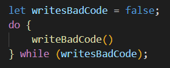

Ook de beste programmeur maakt fouten! 

# Array Methods

Array Methods kunnen veel verschillende dingen doen - het kan zo simpel zijn als items aan een array toevoegen/verwijderen. Het kan ook heel complex zijn, zoals een functie laten uitvoeren op elk item in een bepaald array en het resultaat als een nieuw array teruggeven.

Simpele Array methods om items aan een Array te verwijderen en toe te voegen:

* shift() en pop() verwijderen het eerste en laatste item
* unshift() en push() voegen een item toe op de eerste/laatste plek

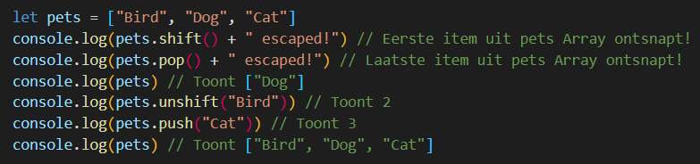

pets.unshift() en pets.push() vangen onze ontsnapte dieren gelukkig, maar de return waarde die getoond wordt is iets heel anders. Wat er wel gereturned wordt is dus de lengte van het nieuwe array. Array methods kunnen dus een return waarde hebben die niet per se overeenkomt met wat ze doen.

Andere belangrijke Array methods.

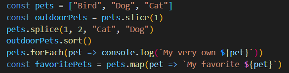

* slice() kopieert een array vanaf een bepaalde index waarde (hier 1). slice() kan ook een 2e parameter mee krijgen - kan je bedenken wat dat doet?
* splice() verwijdert items vanaf een bepaalde index (hier 1), voor een bepaalde hoeveelheid items (hier 2) en vervangt deze met de overige items (Cat, Dog). Effectief sorteert dit het array dus alfabetisch. De laatste 3 parameters zijn allemaal optioneel.
* sort() sorteert een array. Je kan deze een functie als parameter meegeven als je op een specifieke manier wil sorteren.
* forEach() en map() doen bijna hetzelfde - ze voeren beiden een functie uit op elk item in een array. map() slaat daarbij de return waarde op in een nieuw array.

# Arrays & Loops - Opdrachten

### **Opdracht 5.1:**

We oefenen met Arrays.

1. Maak een array met 1 t/m 10 in willekeurige volgorde en log dit.
2. Maak een array met Appel, Aardbei en 3 andere fruitsoorten. Log dit.
3. Gebruik de indexwaarde om Appel en Aardbei in de console te loggen.

Nu gaan we het iets lastiger maken.

4. Gebruik Math.random() en Math.floor() om een random indexwaarde van je array met getallen te selecteren. Gebruik dat getal vervolgens als index om een fruitsoort te selecteren en log dit.

Als je een random getal krijgt met hogere waarde dan de lengte van je fruitsoorten array, zal je code een error geven. Om dit op te lossen kan je de modulo operator gebruiken - het resultaat van X % Y kan nooit groter zijn dan Y!

5. Console log de length property van je fruitsoorten array.
6. Fix de vorige error met modulo en de lengte.

Je kan de index van een item ook gebruiken om de waarde te veranderen.

7. Verander “Appel” naar “Peer”
8. Verwissel “Peer” en “Aardbei” van positie. Kan je dit ook al met/zonder Array method?

### **Opdracht 5.2:**

We oefenen met Loops. Gegeven het volgende array:

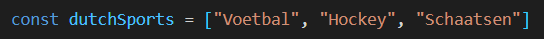

1. Loop door het array heen en log de items 1 voor 1 in je console.
2. Doe nu hetzelfde met een for...in en een for...of loop
3. Maak een for loop die van de getallen 1 t/m 20 de even getallen logt.

Nu gaan we even oefenen met nested loops. Maak nu een for-loop aan die drie keer draait.

4. Maak daarbinnen een for-loop die 1, 2, 3, 4, 5, 6, 7, 8, 9, 10 logt.
5. Je console.log() toont nu 3x 1,2,3,4,5,6,7,8,9,10. Gebruik nu dezelfde 2 loops om eerst 1, 2,3,4,5,6,7,8,9,10 te loggen, vervolgens 2,4,6,8,10,12,14,16,18,20 en uiteindelijk 3,6,9,12,15,18,21,24,27,30.

Nu maken we het iets lastiger. De Reeks van Fibonacci is een lijst met getallen waarbij elk getal een opsomming is van de vorige 2 getallen.

6. Begin met het array [0,1]. Maak vervolgens een loop die dit array vult met de eerste 50 getallen van de Reeks van Fibonacci. Log dit array.

Stel je hebt het volgende array met random getallen [2,7,5,10,4,9,3,1,8,6] en je wil dit sorteren. Er zijn ontzettend veel verschillende methodes om dingen te sorteren - ze zijn niet allemaal even efficiënt. Een van die methodes heet [bubblesort](https://nl.wikipedia.org/wiki/Bubblesort). Een voorbeeld:

1. Bouw een loop die het gegeven array met bubblesort sorteert.

### **Opdracht 5.3:**

We oefenen met Array Methods. Gegeven het volgende array:

Gebruik Array methods om het volgende te doen. Elke vraag gebruikt een andere method:

1. Voeg Zeilen en Zwemmen toe aan het einde van het array
2. Voeg Volleybal toe aan het begin van het array
3. Maak een nieuw array ballSports, met de balsporten uit dutchSports
4. Verwijder die items uit dutchSports.
5. Sorteer het dutchSports array.
6. Log elk item in de console.
7. Maak een nieuw array sportsLength, met daarin de lengte van elk item in het dutchSports array.

### **Opdracht 5.4:**

We onderzoeken Array-Like Objects en nog enkele array methods. 

Array-Like Objects zijn ook lijsten, maar dan met een ander datatype. Ze worden hetzelfde geschreven. Er is wel een cruciaal technisch verschil - Array-Like Objects kunnen geen Array methods gebruiken. Gegeven de volgende code:

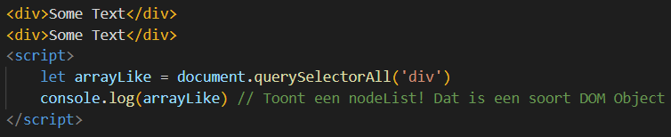

1. Gebruik Array.from() om er een nieuw array van te maken.

Onderzoek de volgende array methods en maak voor elke een voorbeeld:

1. filter()
2. find()
3. some()
4. every()
5. includes()

# Objects

Een Object is een manier om bepaalde eigenschappen en gedrag te groeperen. Zo kan je per gebruiker alle informatie bij elkaar houden. JavaScript gebruikt aardig wat ingebouwde objecten - met enkele heb je al kennis gemaakt. Maar je kan ook je eigen objecten aanmaken! Dat doe je met een zogenaamde **_Constructor_**. De belangrijkste soorten zijn:

* Object Constructor
* Literal Constructor
* Function Constructor
* Singleton Constructor
* Class-based Constructor

De **_Object Constructor_**:

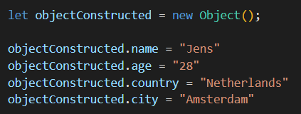

De **_Literal Constructor_**:

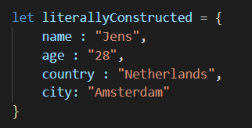

De **_Function Constructor_**:

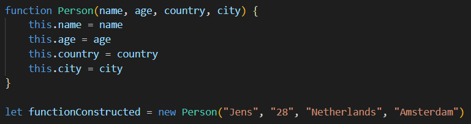

De **_Singleton Constructor_**:

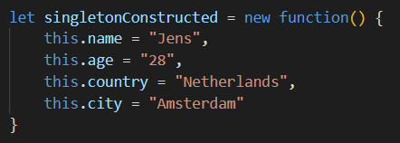

De **_Class-based Constructor:_**

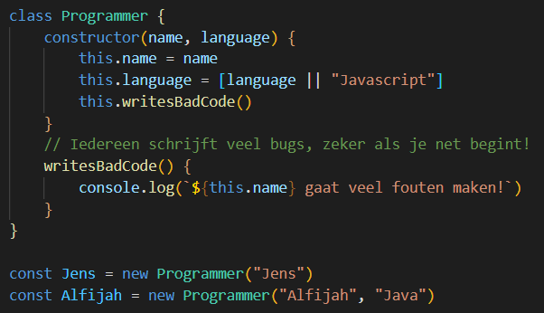

Elke constructor heeft zijn eigen voordelen en nadelen. Een deel van het verschil zit in het omgaan met de **_Object Prototype._** Dat is een voorbeeld waar een Object bepaalde properties en gedrag van kunnen overnemen. 

Misschien wel het allerbelangrijkste onderwerp wat met Objects te maken heeft is **_JSON_**, **_J_**ava**_S_**cript **_O_**bject **_N_**otation. JSON wordt binnen en buiten JavaScript gebruikt om data over het internet te communiceren. Weten hoe je zo’n file uitleest en verwerkt is dus ontzettend belangrijk! Een goede uitleg over JSON kan je [hier](https://www.youtube.com/watch?v=iiADhChRriM) vinden.

# Objects - Opdrachten

### **Opdracht 6.1:**

We oefenen met het aanmaken van Objects.

1. Maak meerdere objects Pet met een naam en een soort. Maak een ander dier met elk van de 5 soorten constructor uit de voorbeelden en log deze in de console. Kijk bij elke ook naar de prototype - kan je een verschil ontdekken?

De laatste veelgebruikte manier om Objecten aan te maken is met Object.create()

2. Gebruik Object.create() om een Object aan te maken. Doe dit voor elke Pet die je in de vorige opdracht hebt gemaakt, en log ze in de console. Valt er iets op aan de prototype?
3. Maak een array met 10 Person Objects, die een naam en leeftijd hebben. Gebruik vervolgens Array methods om je personen te sorteren op leeftijd.

### **Opdracht 6.2:**

We oefenen met nested Objects.

1. Maak een Club class die het volgende bijhoudt:
    * Naam
    * Type club
    * Aantal :Leden
2. Maak een Contactinformatie class aan en voeg die toe aan de Club class. De Contactinformatie houdt het volgende bij:
    * Adres
    * Telefoonnummer
    * Contactpersoon
3. Maak een array met 5 verschillende Clubs aan. Itereer door het array heen en log voor elke Club de naam, het telefoonnummer en de contactpersoon.
4. Geef 2 clubs dezelfde contactpersoon, en verander iets aan deze contactpersoon bij 1 van de 2. Log vervolgens de contactpersoon van de andere club.