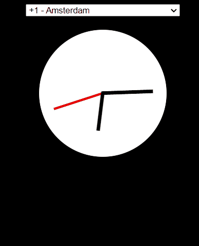
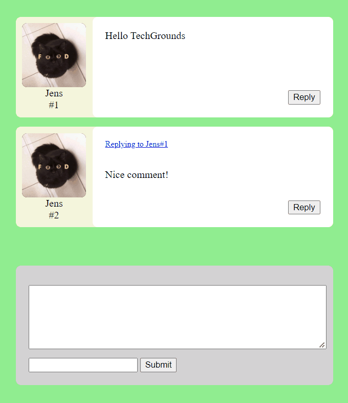
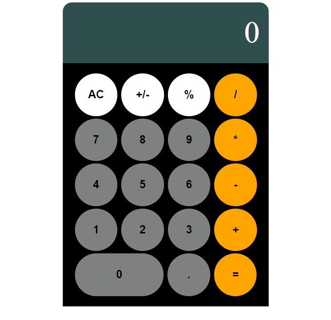
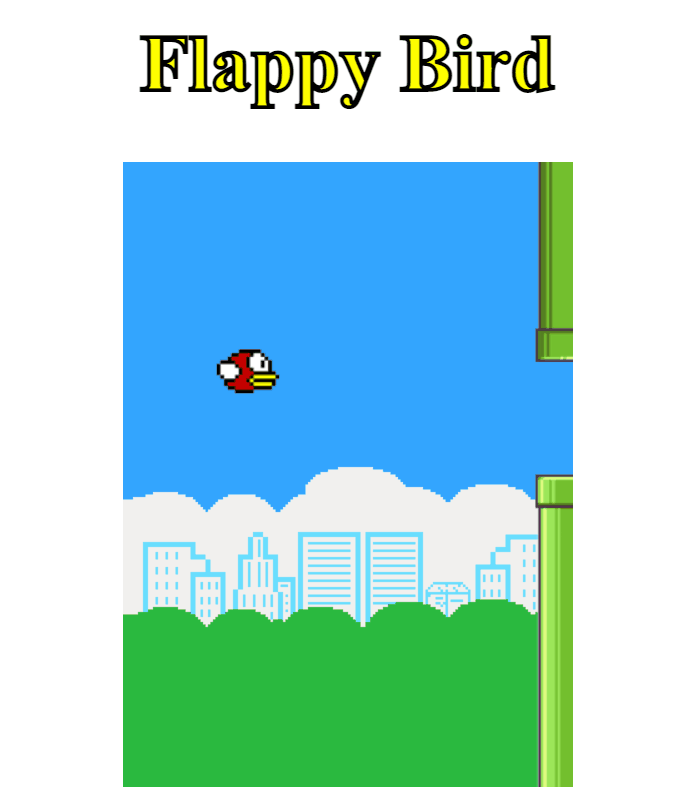
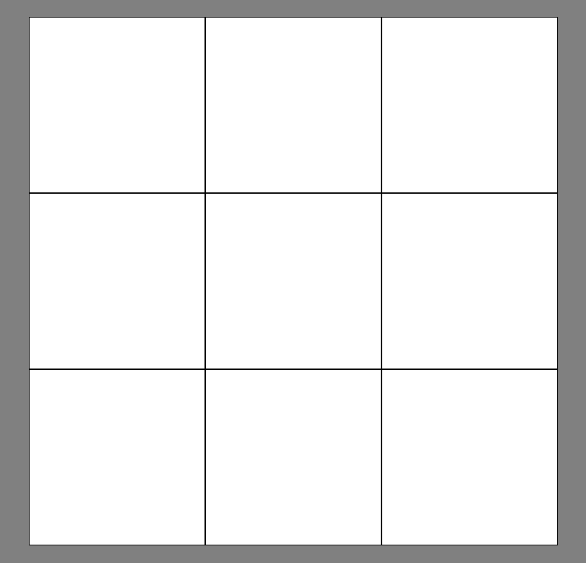

# **Techgrounds JS Challenge!**

Voor de eindopdracht moet je een aantal JS componenten maken. De kennis die je nodig hebt om deze componenten te maken zal je veel gebruiken tijdens je toekomstige werk, en een aantal opdrachten zal je in het echt ook zeker terugzien.

Toch zal er ook ruimte zijn voor persoonlijke invulling - de nadruk ligt bij de logica, maar met een mooie presentatie kan je het ook eerder op je portfolio zetten!

**Maak deze opdracht in een aparte branch in je repository.** Je kan na het aanmaken van de branch dan al een pull request aanmaken. Minstens 1 review hierop krijgen is een onderdeel van de **Definition of Done**

Voor deze opdracht zijn er een aantal criteria:

* Geen gebruik van externe libraries!
* Leesbaarheid van code is veel belangrijker dan efficientie van code
* De naamgeving moet helder en consistent zijn!
  * JS best practice is camelCase of snake_case
* Sommige opdrachten hebben ook nog extra acceptatiecriteria.

# **Verplichte onderdelen:**

### **Clock**

* Meerdere timezones zijn niet verplicht.

### **JSON Cards**

* Je hoeft geen pokedex na te maken - de opdracht is om meerdere cards te genereren uit JSON data
* Je kan hiervoor een JSON generator gebruiken
  * Toch graag pokemon doen? [Hier](https://github.com/fanzeyi/pokemon.json) is een goede dataset
* Extra uitdaging: kan jij favorite cards maken en die als eerste tonen?

### **Carousel**

* Infinite looping is verplicht!
* Je mag ook een carousel met meerdere items naast elkaar maken

### **Comments**

* De comments hoeven niet opgeslagen te worden
* Extra uitdaging: Zorg ervoor dat commenters een eigen plaatje kunnen uploaden

### **Search**

* Zorg ervoor dat de searchdata opgeslagen wordt in localStorage
* Zorg ervoor dat het de zoeksuggesties filtert op basis van wat er ingevuld wordt!

# **Optionele onderdelen:**

### **Calculator**

* Lijkt simpel, maar er zijn heel veel edge cases om te bugtesten
* Extra uitdaging: probeer het zonder **_eval()_**!

### **Flappy Bird**

### **TicTacToe**

### **Quiz**

* Dit was de oude eindopdracht, en is waarschijnlijk een van de lastigste om te maken.
* Denk aan state om de antwoorden van vragen ingevuld te houden als je terugkijkt!
* Je mag pas naar het einde doorklikken als alle vragen ingevuld zijn.

### **Infinite Scrolling Effect**

* Ivm tijdsgebrek helaas geen voorbeeld
* Wel heel handig effect om te beoefenen
* Probeer een set aan ~5 plaatjes oneindig te herhalen!