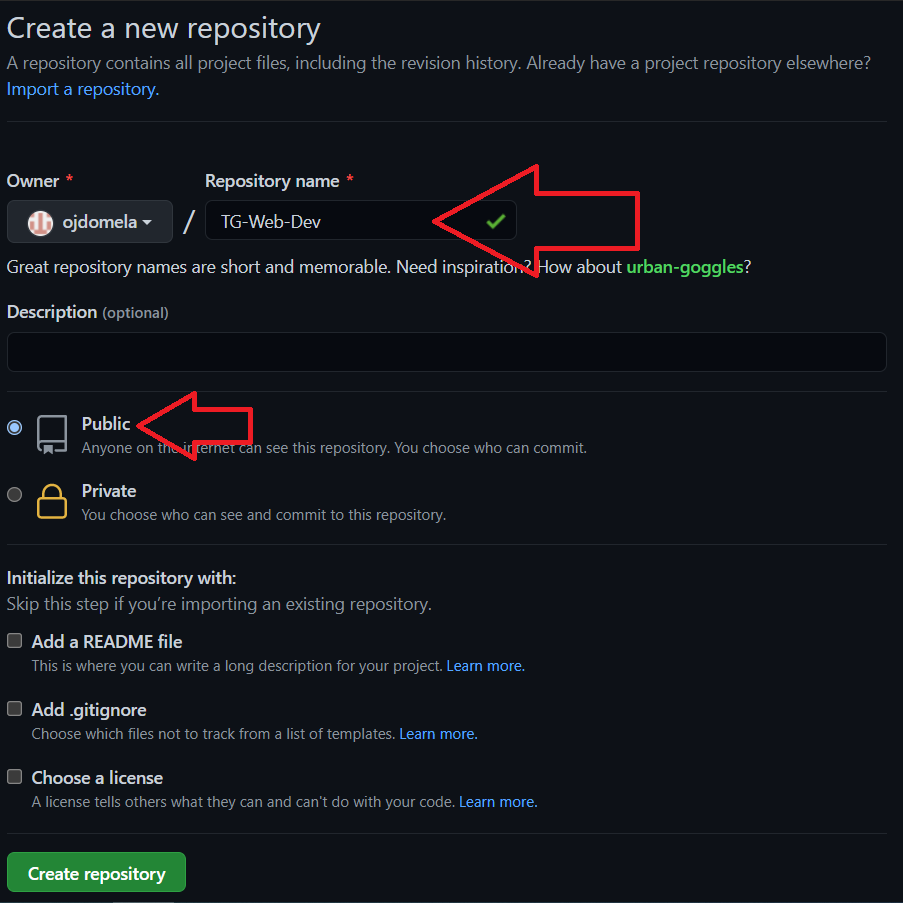
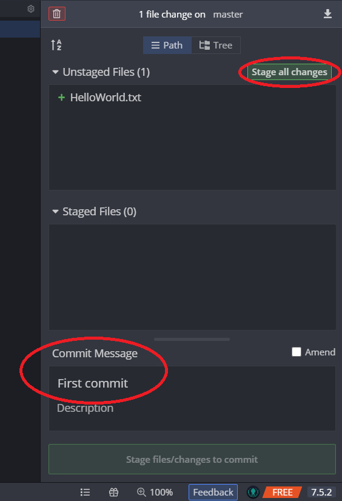

# Git Introductie

In de IT worden programma’s en websites constant veranderd en verbeterd met nieuwe updates. Het komt wel eens voor dat zo’n update niet helemaal goed werkt - dan moet je dus snel terug naar de vorige (werkende) versie. Om dit makkelijk op te lossen gebruikt bijna elk IT-Team een **_version control system_**.

De belangrijkste version control software om te kennen is **_Git_**. Git is ontzettend populair - je kan er als programmeur niet omheen. Om er bekend mee te worden gaan we Git gedurende de hele TechGrounds opleiding gebruiken.

Naast het bijhouden van alle veranderingen in je software heeft Git nog een andere zeer nuttige functionaliteit. Je kan namelijk je code heel makkelijk online zetten - dan heb je gelijk een back-up van je werk. Als je je code openbaar zet (ook wel **_Open Source_** genoemd) dan kunnen andere mensen je code zelfs bekijken en suggesties geven! Je code met Git online zetten kan op verschillende websites. Veruit de belangrijkste hiervoor is **_[GitHub](https://github.com/)_**. 

Git is standaard te gebruiken via een **_Command Line Interface (CLI). _**Dan geef je dus in regeltjes text instructies aan je computer. Als je later meer over Git gaat leren ga je dat dus ook zelf doen.

Toch zijn er ook andere manieren om Git te gebruiken, zoals **_GitKraken_**. GitKraken is een programma dat is ontwikkeld om het gebruik van Git visueler en simpeler te maken. Hiermee kan je dus heel makkelijk je werk naar GitHub uploaden, zonder dat je al heel veel over Git hoeft te weten.

Om Git te kunnen gebruiken, moeten de Git instructies voor je computer te begrijpen zijn. Daarom moet je de software van Git zelf op je computer installeren.

**Links:**

[https://github.com/](https://github.com/) - Maak hier een account aan en geef de naam ervan door.

[https://git-scm.com/downloads](https://git-scm.com/downloads) - Download en installeer hier Git.

[https://www.gitkraken.com/download](https://www.gitkraken.com/download) - Download hier GitKraken

 

# Je eerste repository

Een Git **_repository_** is niets meer dan een project waarvan Git de veranderingen bij gaat houden. Tijdens de opleiding ga je ook een repository gebruiken om alle antwoorden en code in op te slaan. Die repository moet natuurlijk eerst aangemaakt worden. Dat kan op meerdere manieren, maar de makkelijkste manier is met GitHub.

Nu heb je een online plek waar je code naar geupload wordt, maar nog niks op je computer staan. Je moet de repository nu gaan kopiëren naar je eigen computer - daar gaan we GitKraken voor gebruiken.

 

# GitKraken

Als je GitKraken opstart, zal het je vragen om een account te maken of in te loggen. Druk op de optie “inloggen met GitHub” - hiermee zorg je dat je gemakkelijk je Github repository over kan nemen.

Druk vervolgens op Clone Repository, en selecteer Github.com.

Zorg dat je de repository op een makkelijk te vinden plek neerzet!

Nu ga je iets aan je repository toevoegen en dit vervolgens uploaden. Er moet natuurlijk wel een verandering zijn om te uploaden - maak daarom ergens in je repository een .txt bestand en zet er iets in, bijvoorbeeld _“Hello World!”_.

Druk vervolgens op “stage all changes” om al je veranderingen aan een update toe te voegen. Zo’n update noemt Git een **_commit_**. Een commit moet ook een beschrijving hebben, zodat het ook voor andere mensen gelijk duidelijk kan zijn wat er in de update zit zonder naar de inhoud te kijken.

Vervolgens druk je op het groene commit knopje om de update van je repository af te ronden.

Je commit is nu goed in GitKraken te zien, maar er is nog niks aan je GitHub pagina veranderd. Dit komt omdat je nu alleen de lokale versie van je repository hebt geupdate. Om te zorgen dat je veranderingen ook online komen te staan moet je deze uploaden - bij Git wordt dit ook wel **_pushen _** genoemd. Dit kan je in GitKraken doen door op het knopje Push te drukken.

Probeer gedurende de opleiding aan het einde van elke dag je updates te pushen. Hiermee kan je aan de coaches laten zien hoe ver je bent met de opdrachten. Daarnaast is een actief GitHub profiel een goed teken van een actieve programmeur

Als je meer wil leren over Git is Atlassian een hele goede/duidelijke resource:

[https://www.atlassian.com/git](https://www.atlassian.com/git)

# Opdrachten

Er is een hele goede website om Git te beoefenen - [https://learngitbranching.js.org/](https://learngitbranching.js.org/). Maak hier alle oefeningen van!

Hoe je Git precies gaat gebruiken verschilt veel per werkomgeving. Toch is het goed om een beeld te hebben bij de meest gebruikte manier - Git Flow. Lees daarom dit artikel: [https://www.atlassian.com/git/tutorials/comparing-workflows/gitflow-workflow](https://www.atlassian.com/git/tutorials/comparing-workflows/gitflow-workflow)

Probeer daarna ook zelf zo’n flow te gebruiken:

* Maak een eigen Git repo en zet er een simpele HTML file in
* Nodig een groepsgenoot uit om bij te dragen aan je repo.
* Zorg dat jij en je groepsgenoot aparte branches aanmaken om dezelfde HTML file wat aan te passen
* Kijk of je via een Git merge het werk in de branch van je groepsgenoot kan combineren met jouw branch.